RNA-Seq and Expression Arrays: Selection Guidelines for Genome-wide Expression Profiling
================
Jessica Minnier, OHSU
July 28, 2017

-   [Microarray Analysis](#microarray-analysis)
    -   [Venn Diagram of Microarray results](#venn-diagram-of-microarray-results)
    -   [Volcano Plots from MTA analyses](#volcano-plots-from-mta-analyses)
    -   [Significant Genes from microarray results, by locus type](#significant-genes-from-microarray-results-by-locus-type)
-   [RNA-seq Analysis](#rna-seq-analysis)
    -   [Venn Diagram of RNA-seq results](#venn-diagram-of-rna-seq-results)
        -   [Compare edgeR exact test results and voom+limma test results](#compare-edger-exact-test-results-and-voomlimma-test-results)
    -   [Volcano Plots from RNA-seq analyses](#volcano-plots-from-rna-seq-analyses)
-   [Compare RNA-seq and MA](#compare-rna-seq-and-ma)
    -   [Scatterplots of Fold Chages](#scatterplots-of-fold-chages)
        -   [logFC: MA vs RNA-seq by Quartiles of FD6 Expression](#logfc-ma-vs-rna-seq-by-quartiles-of-fd6-expression)
    -   [P-value plots](#p-value-plots)
        -   [MA Plots](#ma-plots)
    -   [Venn Diagrams of Significance](#venn-diagrams-of-significance)
        -   [Intersect q-value and fold change cut offs separately](#intersect-q-value-and-fold-change-cut-offs-separately)
    -   [List of top genes](#list-of-top-genes)
-   [Pathway Analysis](#pathway-analysis)
-   [Table of Results Comparisons](#table-of-results-comparisons)
-   [MA Plot of unflitered RNA-seq by biotype](#ma-plot-of-unflitered-rna-seq-by-biotype)
-   [Methods](#methods)
    -   [RNA-seq](#rna-seq)
    -   [Microarray](#microarray)
    -   [Both](#both)

Microarray Analysis
===================

``` r
# Read in the affy data, normalize, and filter based on background level

if(FALSE){
  # Annotation
  annot_transcript = read_csv("MTA-1_0.na36.mm10.transcript.csv",skip=21) #73033 for each transcript cluster ID
  # Add additional annotation
  annotmta = read_tsv("annotmta.txt")
  annotmta = annotmta%>%dplyr::select(`Transcript Cluster ID`,
                                      `Gene Symbol`,
                                      `Public Gene IDs`,
                                      Chromosome,
                                      Description)
  annotmta = annotmta%>%dplyr::rename(transcript_cluster_id = `Transcript Cluster ID`)
  annot_transcript = full_join(annot_transcript,annotmta)
  rm(annotmta)
  
  #add in code from S drive to make annot_transcript
}
annot_transcript = read_csv("../data/annot_transcript.csv")
xx = str_split(annot_transcript$`Gene Symbol`,pattern = "; ")
names(xx) = annot_transcript$transcript_cluster_id
all_mta_genesymbols = unlist(xx) # can use to match to RNA-seq?
all_mta_genesymbols = na.omit(all_mta_genesymbols)


celdir <- "../data/celfiles_fd6_fn/"
celnames <- list.celfiles(celdir, full.name=TRUE)
t1 <- system.time(affy_data <- oligo::read.celfiles(celnames)) #41 seconds
```

    ## Reading in : ../data/celfiles_fd6_fn//009A_A1H1_FD6-1_2000a_639PS.CEL
    ## Reading in : ../data/celfiles_fd6_fn//011A_A1H1_FD6-2_2000_639PS.CEL
    ## Reading in : ../data/celfiles_fd6_fn//013A_A1H1_FN-1_639PS.CEL
    ## Reading in : ../data/celfiles_fd6_fn//014A_A1H1_FN-2_639PS.CEL

``` r
# RMA normalization
affy_rma = oligo::rma(affy_data,target="core")
```

    ## Background correcting
    ## Normalizing
    ## Calculating Expression

``` r
eset.rma = exprs(affy_rma)

# we only want main genes
annotdat_main = annot_transcript%>%filter(category%in%c("main","main->rescue"))
tmpind_main = which(rownames(eset.rma)%in%annotdat_main$transcript_cluster_id)
eset.rma_main = eset.rma[tmpind_main,]

# use antigenomic controls to calculate background
annotdat_ctrl = annot_transcript%>%filter(category=="control->bgp->antigenomic")
tmpind = which(rownames(eset.rma)%in%annotdat_ctrl$transcript_cluster_id)
tmpdat_back = eset.rma_main[tmpind,]
bkgd <- quantile(tmpdat_back,probs=.95) #around 6-8
#print(bkgd)
  
# keep genes with at least 2 above background = around 13k genes
tmpind_filter <-  which(genefilter(eset.rma_main, filterfun(kOverA(k=2, A=bkgd))))
#print(length(tmpind_filter)) # number kept
eset.rma_filtered = eset.rma_main[tmpind_filter,]
```

After filtering, we have 13230 transcript clusters in the data set (from a total of 65956).

``` r
## create sampinfo data frame
filenames <- str_replace(colnames(affy_data),pattern = ".CEL","")
sampids = str_replace(filenames,"_639PS","")
sampinfo = str_split(sampids,"_",simplify = TRUE)
sampinfo = as_data_frame(sampinfo[,-(ncol(sampinfo))])
colnames(sampinfo) <- c("sampnum","hyb","tissueid")
sampinfo = sampinfo%>%add_column("affy_filename"=filenames,.before = "sampnum")
sampinfo = sampinfo%>%separate(tissueid,c("trt","repnum"),sep = "-",remove = FALSE)


colnames(eset.rma) = colnames(eset.rma_main) = colnames(eset.rma_filtered) = sampinfo$tissueid
```

``` r
density_plots(as.matrix(eset.rma_main),col.labels = sampinfo$tissueid,
                  colvec = 1:4,ltyvec = c(1,1,2,2),
              title="Distribution of Microarray, RMA")
```

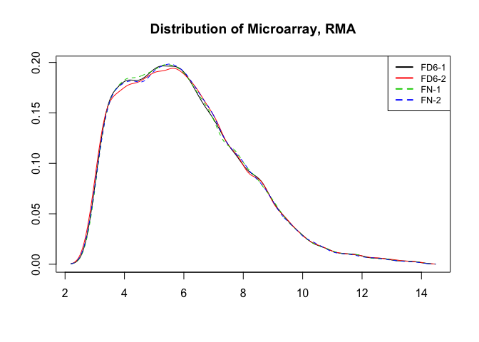

``` r
density_plots(as.matrix(eset.rma_filtered),col.labels = sampinfo$tissueid,
                  colvec = 1:4,ltyvec = c(1,1,2,2),
              title="Distribution of Microarray, RMA+Filtered")
```

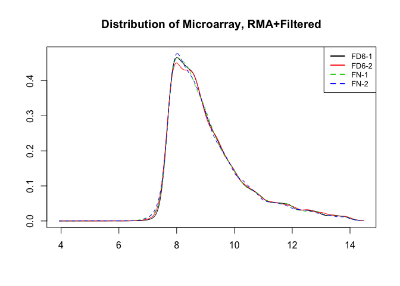

``` r
FD6vsFN <- relevel(as.factor(sampinfo$trt),ref="FN")
design <- model.matrix(~FD6vsFN)
rownames(design) = colnames(eset.rma_filtered)
colnames(design) <- c("FN","FD6")

tmplimma <- lmFit(eset.rma_filtered,design=design)
fit <- eBayes(tmplimma)
fit_MA = fit
tmpres = topTable(fit,number = nrow(eset.rma_filtered),coef=2)
tmpres <- rownames_to_column(tmpres, "transcript_cluster_id")
results_MA <- tmpres%>%
  dplyr::select(transcript_cluster_id,logFC,P.Value,adj.P.Val)%>%
  dplyr::rename(
        "logFC_MA_limma"=logFC,
        "pvalue_MA"=P.Value,
        "qvalue_MA_BH"=adj.P.Val)%>%
  mutate("qvalue_MA_Storey" = qvalue(pvalue_MA)$qvalues,
         #"signif_MA_Storey" = 1*(qvalue_MA_Storey<.05)*(abs(logFC_MA_limma)>0.5))
         "signif_MA_Storey" = 1*(qvalue_MA_Storey<.05))
rm(tmpres)

# Add normalized intensities from MTA - affy

mtaexpr = as.data.frame(eset.rma_filtered)
colnames(mtaexpr) = c(paste0("FD6.affy.mta.rma_",1:2),paste0("FN.affy.mta.rma_",1:2))
mtaexpr = mtaexpr%>%rownames_to_column("transcript_cluster_id")

results_MA = left_join(results_MA,mtaexpr)
results_MA = left_join(results_MA,annot_transcript)
results_MA$geneid = results_MA$`Gene Symbol`

results_MA = results_MA%>%mutate(
  FD6.affy.mta.rma_mean = apply(cbind(FD6.affy.mta.rma_1,FD6.affy.mta.rma_2),1,mean),
  FN.affy.mta.rma_mean = apply(cbind(FN.affy.mta.rma_1,FN.affy.mta.rma_2),1,mean),
  FD6FN.affy.mta.rma_mean = apply(cbind(FD6.affy.mta.rma_1,FD6.affy.mta.rma_2,
                                        FN.affy.mta.rma_1,FN.affy.mta.rma_2),1,mean),
  FD6.affy.mta.rma_sd = apply(cbind(FD6.affy.mta.rma_1,FD6.affy.mta.rma_2),1,sd),
  FN.affy.mta.rma_sd = apply(cbind(FN.affy.mta.rma_1,FN.affy.mta.rma_2),1,sd)
)
```

``` r
qq.limma = qvalue(results_MA$pvalue_MA)
```

Storey's q-value method estimates  *π*<sub>0</sub> as 0.613 which estimates the proportion of null p-values or non-differentially expressed genes.

``` r
hist(qq.limma)
```

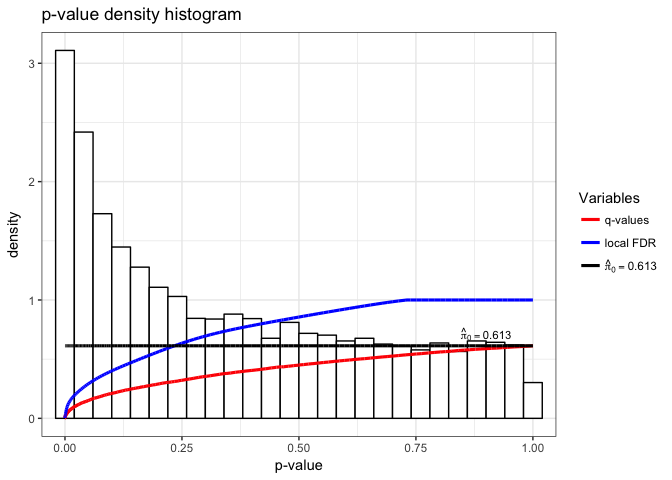

``` r
summary(qq.limma)
```

    ## 
    ## Call:
    ## qvalue(p = results_MA$pvalue_MA)
    ## 
    ## pi0: 0.6130334   
    ## 
    ## Cumulative number of significant calls:
    ## 
    ##           <1e-04 <0.001 <0.01 <0.025 <0.05 <0.1    <1
    ## p-value       52    443  1197   1870  2687 3840 13230
    ## q-value        0      0    14    591   962 1691 13230
    ## local FDR      0      0    14    321   581  885 11033

Venn Diagram of Microarray results
----------------------------------

Total of `nrow(results_MA)` genes (transcript clusters).

``` r
tmpind1 = which(results_MA$qvalue_MA_Storey<.05)
tmpind2 = which(abs(results_MA$logFC_MA_limma)>0.5)

plot(Venn(list("abs(logFC) > 0.5            "=tmpind2,
               "                qval<.05  "=tmpind1)),doWeights=TRUE)
```

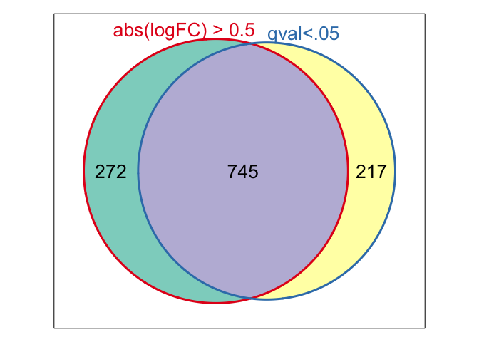

Volcano Plots from MTA analyses
-------------------------------

Results are from limma regression of the background filtered microarray data. The top 10 genes are highlighted.

``` r
tmpgenes = results_MA%>%filter(signif_MA_Storey==1)%>%
  arrange(qvalue_MA_Storey,
          desc(abs(logFC_MA_limma)))%>%dplyr::select(geneid)%>%unlist

gene_volcanoplot(results_MA,
                 pval.name="pvalue_MA",
                 padj.name = "qvalue_MA_Storey",
                 log2fc.name = "logFC_MA_limma",
                 id.name = "geneid",
                 sel_genes = tmpgenes[1:10],
                 padj.cut = 0.05,
                 log2fc.cut = 0.5,
                 main = "Microarray Volcano Plot",xlim=c(-5,6))
```

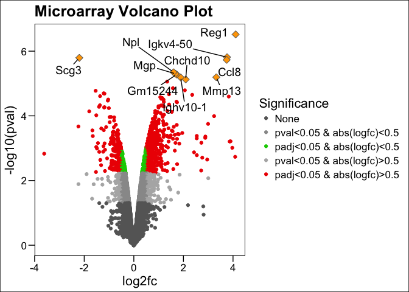

Significant Genes from microarray results, by locus type
--------------------------------------------------------

Significance is defined as Storey's q-value &lt; 0.05.

``` r
tmptab = table(results_MA$`locus type`,results_MA$signif_MA_Storey)
colnames(tmptab) = c("Not Significant", "Significant")
kable(tmptab)
```

|                     |  Not Significant|  Significant|
|---------------------|----------------:|------------:|
| Coding              |             2490|          258|
| Multiple\_Complex   |             6101|          413|
| NonCoding           |             1638|          252|
| Precursor\_microRNA |              607|            4|
| Pseudogene          |             1099|           31|
| Ribosomal           |               19|            1|
| Small\_RNA          |              308|            3|
| tRNA                |                4|            0|
| Unassigned          |                2|            0|

RNA-seq Analysis
================

``` r
library(EnsDb.Mmusculus.v79)
library(ensembldb)

rnaseq_counts <- read_tsv("../data/p1_rawcounts_fd6_fn.txt")
tmpensemb = str_split_fixed(rnaseq_counts$ensembl_id,pattern=fixed("."),n=2)
rnaseq_counts$ensembl_id = tmpensemb[,1]

# add annotation
annot <- AnnotationDbi::select(org.Mm.eg.db,keys=rnaseq_counts$ensembl_id,
                               keytype="ENSEMBL",
                               columns=c("ENSEMBL","SYMBOL","GENENAME"))
sort(table(annot$ENSEMBL),decreasing = TRUE)[1:20]
```

    ## 
    ## ENSMUSG00000094739 ENSMUSG00000093868 ENSMUSG00000101155 
    ##                 35                 27                 17 
    ## ENSMUSG00000094660 ENSMUSG00000096122 ENSMUSG00000053742 
    ##                  9                  9                  8 
    ## ENSMUSG00000073158 ENSMUSG00000093848 ENSMUSG00000060565 
    ##                  8                  8                  7 
    ## ENSMUSG00000096016 ENSMUSG00000096898 ENSMUSG00000094294 
    ##                  7                  7                  6 
    ## ENSMUSG00000094729 ENSMUSG00000095302 ENSMUSG00000095634 
    ##                  6                  6                  6 
    ## ENSMUSG00000044227 ENSMUSG00000058600 ENSMUSG00000074417 
    ##                  5                  5                  5 
    ## ENSMUSG00000091477 ENSMUSG00000092166 
    ##                  5                  5

``` r
gene_dataframe_EnsDb <- ensembldb::genes(EnsDb.Mmusculus.v79,
              columns=c("gene_id","entrezid", "gene_biotype"), #gene_name
              filter=list(GeneidFilter(rnaseq_counts$ensembl_id)),
              return.type="data.frame")
colnames(gene_dataframe_EnsDb)[1] = "ensembl_id"

#deal with multimappers by making symbol=NA
annot_symbol <- AnnotationDbi::mapIds(org.Mm.eg.db,keys=rnaseq_counts$ensembl_id,
                               keytype="ENSEMBL",
                               column="SYMBOL",multiVals = "asNA")

# tmpout = right_join(annot,rnaseq_counts_filtered,by=c("ENSEMBL"="ensembl_id")) #some duplicates
# tmpout = right_join(annot[match(rnaseq_counts_filtered$ensembl_id,annot$ENSEMBL),],
#                     rnaseq_counts_filtered,by=c("ENSEMBL"="ensembl_id"))

rnaseq_counts = rnaseq_counts%>%
  add_column("geneSymbol"=annot_symbol,.after="gene_name")
rnaseq_counts = left_join(rnaseq_counts,gene_dataframe_EnsDb)
rnaseq_counts = rnaseq_counts%>%dplyr::select(ensembl_id,gene_name,geneSymbol,entrezid,gene_biotype,everything())


# not anymore: keep genes with at least 2 with log2(counts+1) above 5
# keep genes with at least 2 with log2cpm above 1
# tmpind_filter <- which(genefilter(log2(1+rnaseq_counts[,-(1:3)]), 
#                                   filterfun(kOverA(k=2, A=5))))
dge <- edgeR::DGEList(counts=rnaseq_counts[,-(1:5)]) # TMM normalization
tmpind_filter <- which(rowSums(edgeR::cpm(dge)>0.2) >= 2)
#print(length(tmpind_filter)) # number kept
rnaseq_counts_filtered = rnaseq_counts[tmpind_filter,]
counts = rnaseq_counts_filtered[,-(1:5)]


#Some gene names are duplicated, can be resolved by mapping ensembl id to symbol
#Some gene names have been converted to dates by excel, need to fix this
```

There are 16696 out of 45706 genes in the RNA-seq data (after filtering out low log2-counts) used for differential expression analysis.

``` r
density_plots(as.matrix(log2(1+rnaseq_counts[,-(1:5)])),col.labels = sampinfo$tissueid,
                  colvec = 1:4,ltyvec = c(1,1,2,2),
              title="Distribution of RNA-seq, log2(Counts+1)")
```

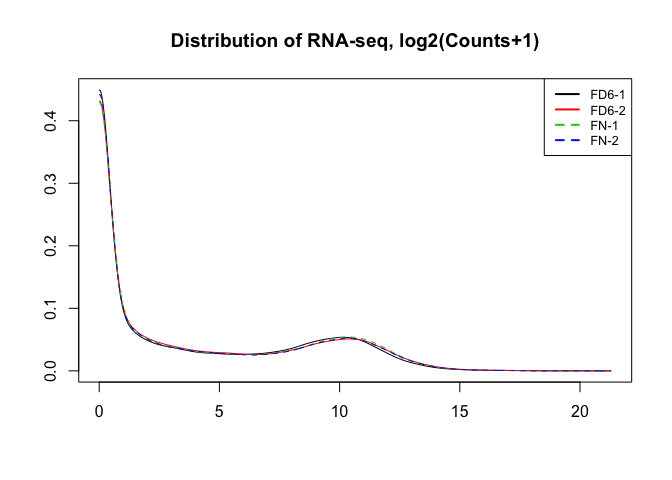

``` r
density_plots(as.matrix(log2(1+counts)),col.labels = sampinfo$tissueid,
                  colvec = 1:4,ltyvec = c(1,1,2,2),
              title="Distribution of RNA-seq, log2(Counts+1)+Filtered")
```

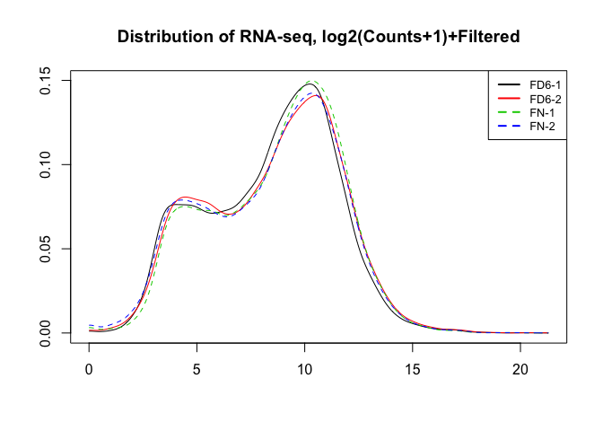

``` r
group <- rep(c("FD6","FN"),each=2)
y <- edgeR::DGEList(counts=counts,group=group)
y <- edgeR::calcNormFactors(y)
y <- edgeR::estimateDisp(y,design = design)
de <- edgeR::exactTest(y,pair=c("FN","FD6"))
tmpres = edgeR::topTags(de,n = nrow(counts),sort.by = "none")
tmpres = as.data.frame(tmpres)%>%dplyr::select(logFC,PValue,FDR)
tmpres <- cbind(rnaseq_counts_filtered[,1:5],tmpres)
results_rnaseq_exact <- tmpres%>%
  dplyr::rename(
        "logFC_RNAseq"=logFC,
        "pvalue_RNAseq"=PValue,
        "qvalue_RNAseq_BH"=FDR)%>%
  mutate("qvalue_RNAseq_Storey" = qvalue(pvalue_RNAseq)$qvalues,
         #"signif_RNAseq_Storey" = 1*(qvalue_RNAseq_Storey<.05)*(abs(logFC_RNAseq)>0.5))
         "signif_RNAseq_Storey" = 1*(qvalue_RNAseq_Storey<.05))
colnames(results_rnaseq_exact)[-(1:5)] = paste0(colnames(results_rnaseq_exact)[-(1:5)],"_exact")
rm(tmpres)

# Add normalized intensities

logcpm <- edgeR::cpm(y, prior.count=2, log=TRUE)

rnaseqexpr = as.data.frame(logcpm)
colnames(rnaseqexpr) = c(paste0("FD6.rnaseq.edgeR_",1:2),paste0("FN.rnaseq.edgeR_",1:2))
rnaseqexpr = cbind(rnaseq_counts_filtered[,1:2],rnaseqexpr)

results_rnaseq_exact = left_join(results_rnaseq_exact,rnaseqexpr)

results_rnaseq_exact = results_rnaseq_exact%>%mutate(
  FD6.rnaseq.edgeR_mean = apply(cbind(FD6.rnaseq.edgeR_1,FD6.rnaseq.edgeR_2),1,mean),
  FN.rnaseq.edgeR_mean = apply(cbind(FN.rnaseq.edgeR_1,FN.rnaseq.edgeR_2),1,mean),
  FD6FN.rnaseq.edgeR_mean = apply(cbind(FN.rnaseq.edgeR_1,FN.rnaseq.edgeR_2,FN.rnaseq.edgeR_1,FN.rnaseq.edgeR_2),1,mean),
  FD6.rnaseq.edgeR_sd = apply(cbind(FD6.rnaseq.edgeR_1,FD6.rnaseq.edgeR_2),1,sd),
  FN.rnaseq.edgeR_sd = apply(cbind(FN.rnaseq.edgeR_1,FN.rnaseq.edgeR_2),1,sd)
)
```

``` r
dge <- edgeR::DGEList(counts=counts) # TMM normalization
dge <- edgeR::calcNormFactors(dge)
v <- voom(dge,design,plot=FALSE) # voom transformation
#v2 <- voom(counts,design,plot=TRUE,normalize="quantile")

tmplimma <- lmFit(v,design=design)
fit <- eBayes(tmplimma)
fit_RNAseq = fit
tmpres = topTable(fit,number = nrow(v),coef=2,sort.by = "none")
tmpres = tmpres%>%dplyr::select(logFC,P.Value,adj.P.Val)
tmpres <- cbind(rnaseq_counts_filtered[,1:5],tmpres)
results_rnaseq <- tmpres%>%
  dplyr::rename(
        "logFC_RNAseq_limma"=logFC,
        "pvalue_RNAseq"=P.Value,
        "qvalue_RNAseq_BH"=adj.P.Val)%>%
  mutate("qvalue_RNAseq_Storey" = qvalue(pvalue_RNAseq)$qvalues,
         #"signif_RNAseq_Storey" = 1*(qvalue_RNAseq_Storey<.05)*(abs(logFC_RNAseq_limma)>0.5))
         "signif_RNAseq_Storey" = 1*(qvalue_RNAseq_Storey<.05))
rm(tmpres)

# Add normalized intensities

rnaseqexpr = as.data.frame(v$E)
colnames(rnaseqexpr) = c(paste0("FD6.rnaseq.voom_",1:2),paste0("FN.rnaseq.voom_",1:2))
rnaseqexpr = cbind(rnaseq_counts_filtered[,1:2],rnaseqexpr)

results_rnaseq = left_join(results_rnaseq,rnaseqexpr)

results_rnaseq = results_rnaseq%>%mutate(
  FD6.rnaseq.voom_mean = apply(cbind(FD6.rnaseq.voom_1,FD6.rnaseq.voom_2),1,mean),
  FD6FN.rnaseq.voom_mean = apply(cbind(FD6.rnaseq.voom_1,FD6.rnaseq.voom_2,
                                       FN.rnaseq.voom_1,FN.rnaseq.voom_2),1,mean),
  FN.rnaseq.voom_mean = apply(cbind(FN.rnaseq.voom_1,FN.rnaseq.voom_2),1,mean),
  FD6.rnaseq.voom_sd = apply(cbind(FD6.rnaseq.voom_1,FD6.rnaseq.voom_2),1,sd),
  FN.rnaseq.voom_sd = apply(cbind(FN.rnaseq.voom_1,FN.rnaseq.voom_2),1,sd)
)
```

``` r
qq.limma = qvalue(results_rnaseq$pvalue_RNAseq)
```

Storey's q-value method estimates  *π*<sub>0</sub> as 0.499 which estimates the proportion of null p-values or non-differentially expressed genes.

``` r
hist(qq.limma)
```

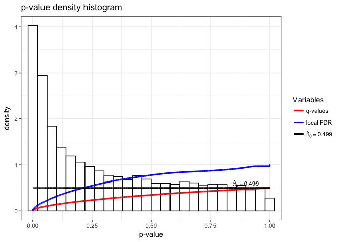

``` r
summary(qq.limma)
```

    ## 
    ## Call:
    ## qvalue(p = results_rnaseq$pvalue_RNAseq)
    ## 
    ## pi0: 0.4992155   
    ## 
    ## Cumulative number of significant calls:
    ## 
    ##           <1e-04 <0.001 <0.01 <0.025 <0.05 <0.1    <1
    ## p-value       80    492  1863   3024  4252 5891 16696
    ## q-value        0      0    74    852  2095 4309 16696
    ## local FDR      0      0    90    467  1083 2228 16694

Venn Diagram of RNA-seq results
-------------------------------

Total of 16696 genes.

Voom+Limma results:

``` r
tmpind1 = which(results_rnaseq$qvalue_RNAseq_Storey<.05)
tmpind2 = which(abs(results_rnaseq$logFC_RNAseq_limma)>0.5)

plot(Venn(list("abs(logFC) > 0.5            "=tmpind2,
               "                qval<.05  "=tmpind1)),doWeights=TRUE)
```

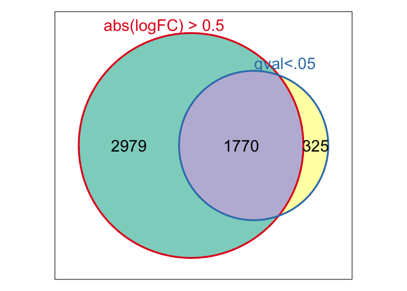

Exact test results:

``` r
tmpind1 = which(results_rnaseq_exact$qvalue_RNAseq_Storey_exact<.05)
tmpind2 = which(abs(results_rnaseq_exact$logFC_RNAseq_exact)>0.5)

plot(Venn(list("Exact abs(logFC) > 0.5            "=tmpind2,
               "                  Exact qval<.05  "=tmpind1)),doWeights=TRUE)
```

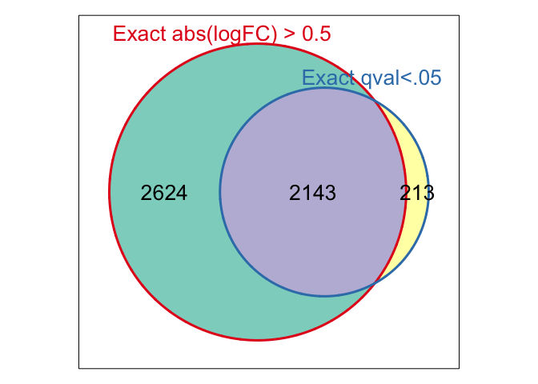

### Compare edgeR exact test results and voom+limma test results

The voom+limma results are good for comparison to the microarray results since they both use moderated t-statistics and more steps in the pipeline are identical. However, with 2 subjects in each group I was concerned the estimates of the standard errors would be unstable and the normality assumption would be difficult to assess. Therefore, I also analyzed the data with the negative binomial exact test in the `edgeR` package in Bioconductor. The results are actually very similar, with the exception that the p-values and q-values from edgeR are strikingly smaller. However, the significant genes sets are very similar with high overlap (close to 2000 of 2300 significant with each test), and the estimated log fold changes are almost identical.

``` r
tmpind1 = which(results_rnaseq_exact$qvalue_RNAseq_Storey_exact<.05)
tmpind2 = which(abs(results_rnaseq_exact$logFC_RNAseq_exact)>0.5)
tmpind3 = which(results_rnaseq$qvalue_RNAseq_Storey<.05)
tmpind4 = which(abs(results_rnaseq$logFC_RNAseq_limma)>0.5)

# plot(Venn(list("Exact abs(logFC) > 0.5 "=tmpind2,
#                "Exact qval<.05  "=tmpind1,
#                "Limma abs(logFC) > 0.5 "=tmpind4,
#                "Limma qval<.05  "=tmpind3
#                )),doWeights=FALSE)
#                
plot(Venn(list(
               "Exact qval<.05           "=tmpind1,
               "              Limma qval<.05  "=tmpind3
               )),doWeights=FALSE)
```

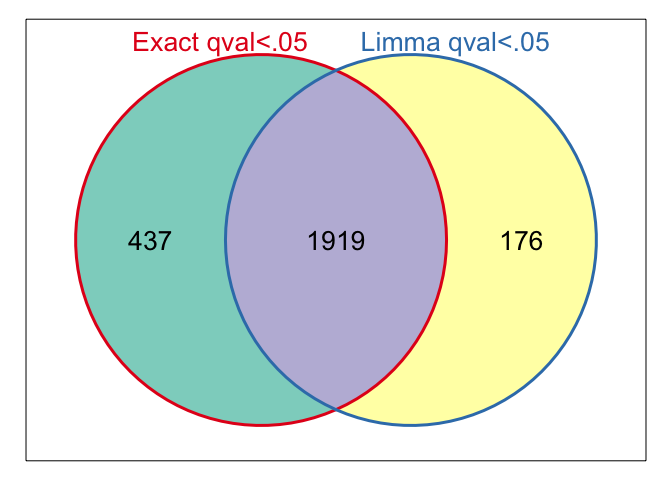

``` r
tmpdat = left_join(results_rnaseq,results_rnaseq_exact)
tmpdat$signif = tmpdat$signif_RNAseq_Storey+2*tmpdat$signif_RNAseq_Storey_exact
tmpdat$signif = factor(tmpdat$signif,levels=0:3,labels=c("Not Signif","Only Limma","Only Exact","Both"))

ggplot(tmpdat,aes(x=logFC_RNAseq_limma,logFC_RNAseq_exact,color=signif))+
  geom_point(alpha=0.5)+theme_minimal()+ggtitle("LogFC Voom+Limma vs Exact")+
  geom_abline()
```

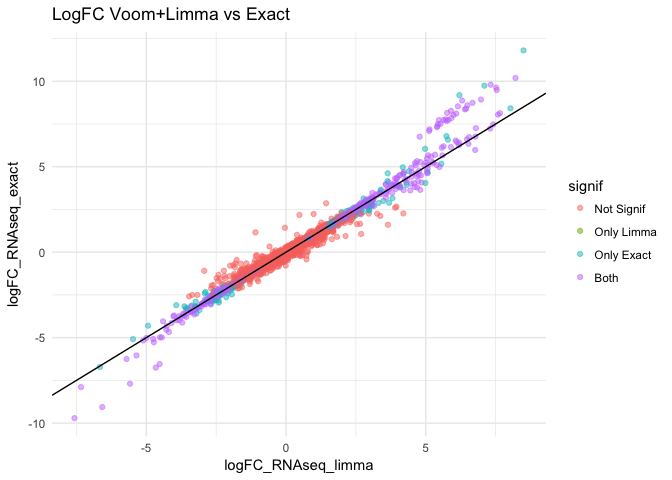

``` r
ggplot(tmpdat,aes(x=-log10(qvalue_RNAseq_Storey),
                  -log10(qvalue_RNAseq_Storey_exact),
                  color=signif))+geom_point(alpha=0.5)+theme_minimal()+
  ggtitle("-log10(qvalue) Voom+Limma vs Exact")
```

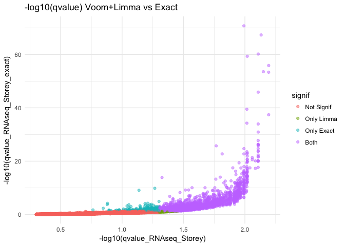

``` r
tmp1 = results_rnaseq
tmp2 = results_rnaseq_exact
tmp1$signif = tmpdat$signif
tmp2$signif = tmpdat$signif
tmp1$test = "voom+limma"
tmp2$test = "exact"
colnames(tmp1) = colnames(tmp2) = c(colnames(results_rnaseq)[1:5],"logFC","pvalue","qvalueBH","qvalue","signif1","a","b","c","d","FD6_mean","FN_mean","mean_expr","FD6_sd","FN_sd","signif","test")
tmplong = bind_rows(tmp1,tmp2)

tmplong$signif_onlyone = factor(as.numeric(tmplong$signif)%in%c(2,3),labels=c("None/Both","OnlyOne"))
ggplot(tmplong,aes(x=mean_expr,y=logFC,color=signif))+geom_point(alpha=0.5)+facet_grid(~test)+
  theme_minimal()
```


``` r
ggplot(tmplong,aes(x=mean_expr,y=logFC,color=signif))+geom_point(alpha=0.5)+
  facet_grid(signif_onlyone~test,scales = "free")+
  theme_minimal()
```

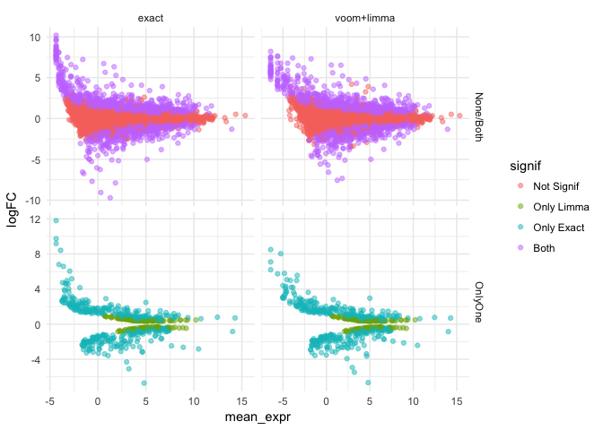

Volcano Plots from RNA-seq analyses
-----------------------------------

Results are from voom+limma regression of the filtered RNA-seq data. The top 10 genes are highlighted.

``` r
tmpgenes = results_rnaseq%>%filter(signif_RNAseq_Storey==1)%>%
  arrange(qvalue_RNAseq_Storey,
          abs(logFC_RNAseq_limma))%>%dplyr::select(gene_name)%>%unlist

gene_volcanoplot(results_rnaseq,
                 pval.name="pvalue_RNAseq",
                 padj.name = "qvalue_RNAseq_Storey",
                 log2fc.name = "logFC_RNAseq_limma",
                 id.name = "gene_name",
                 sel_genes = tmpgenes[1:10],
                 padj.cut = 0.05,
                 log2fc.cut = 0.5,
                 main = "RNA-seq Volcano Plot",xlim=c(-5,6))
```

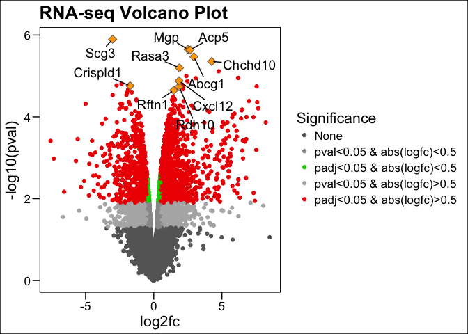

Compare RNA-seq and MA
======================

We first matched based on Ensembl IDs (mapping microarray data with `AnnotationDBI` package from transcript cluster ID). Then for genes still unmapped, we mapped Ensembl to gene symbol via `AnnotationDBI` for RNA-seq, and mapped those symbols to the Gene Symbol generated from Affymetrix Transcriptome Analysis Console. If the RNA-seq symbol mapped to multiple transcript clusters, we chose the first match. This resulted in 11417 mapped RNA-seq genes to microarray transcript clusters, out of 16696 (68.4%) RNA-seq genes and 13230 (86.3%) microarray genes in the analysis data sets.

Here is a venn diagram of the overlapping gene sets using Ensembl IDs:

``` r
tmp1 = na.omit(unique(stringr::str_to_upper(results_rnaseq$ensembl_id)))
tmp2 = na.omit(unique(stringr::str_to_upper(results_MA$ENSEMBL)))
plot(Venn(list("RNA-seq Ensembl"=tmp1,"MA Ensembl"=tmp2)))
```

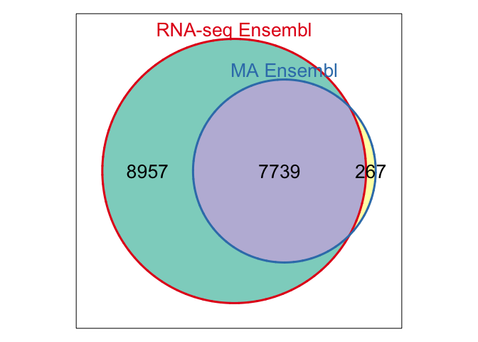

Scatterplots of Fold Chages
---------------------------

``` r
tmpvec = results_all$FD6.rnaseq.voom_mean
tmpcut = median(tmpvec,na.rm=T)
results_all$tmp = cut(tmpvec,
                     breaks=c(floor(min(tmpvec,na.rm=T)),
                              quantile(tmpvec,probs=c(0.25,0.5,0.75),na.rm=T),
                              ceiling(max(tmpvec,na.rm=T)))
)
#levels(results_all$tmp) = paste("FD6 RNA-seq expr in",levels(results_all$tmp))
levels(results_all$tmp) = paste0("Expression",c("[0-25%]","[25-50%]","[50-75%]","[75-100%]"))

tmpdat = results_all%>%filter(!is.na(tmp))%>%
  group_by(tmp)%>%summarise(cor=cor(logFC_MA_limma,logFC_RNAseq_limma,use="pairwise.complete.obs"),
                            minx = .2*min(results_all$logFC_RNAseq_limma,na.rm=T),
                            maxy = 1.1*max(results_all$logFC_MA_limma,na.rm=T),
                            cortext = sprintf("cor=%.2f",cor))


tmpdat2 = results_all%>%filter(!is.na(tmp))%>%group_by(tmp)%>%
  do(mod = lm(.$logFC_RNAseq_limma~.$logFC_MA_limma))

#tmpdat2%>%mutate(lmtext = sprintf("y=%.2f + %.2f*x",mod$coefficients[1],mod$coefficients[2]))
                           
tmpdat$lmtext = sapply(tmpdat2$mod,function(k) sprintf("y=%.2f+%.2fx",k$coefficients[1],k$coefficients[2]))
tmpdat$r2 = sapply(tmpdat2$mod,function(k) sprintf("r2=%.2f",summary(k)$r.squared))

                            #lmtext = sprintf("y=%.2f + %.2f*x",int,slope))
```

Here we show that logFC between FD6 and FN is correlated between microarray and RNA-seq. Each panel represents a quartile of RNA-seq expression levels. The correlation between MA and RNA-seq logFC in genes with lowest expression levels is 0.698 while the correlation between MA and RNA-seq logFC in genes with highest expression is 0.954.

### logFC: MA vs RNA-seq by Quartiles of FD6 Expression

CAPTION: Scatterplot of log2-fold-change in RNA-seq (y-axis) vs. microarray (x-axis). Each point represents a gene, with darker color representing higher average expression in the FD6 group with RNA-seq data. Panels represent the quantiles of average FD6 RNA-seq expression. Pearson correlations are presented as well as the intercept and slope of a univariate regression of y = log2-FC (RNA-seq) regressed on x = log2-FC (MA). Black line represents diagonal.

``` r
ggplot(data = results_all%>%filter(!is.na(logFC_MA_limma),!is.na(logFC_RNAseq_limma),!is.na(tmp)),
       aes(x = logFC_MA_limma, y = logFC_RNAseq_limma, color = FD6.rnaseq.voom_mean)) +
  geom_point() +
  facet_wrap(~ tmp) +
  geom_text(data = tmpdat,aes(x=minx,y=maxy,label=paste(lmtext,"\n",cortext)),size=3,inherit.aes = FALSE)+
  geom_abline(intercept = 0, slope = 1) +
  #ggtitle(paste0("logFC: MA vs RNA-seq by Quartiles of FD6 Expression"))+
  scale_color_gradient_tableau(name="RNA-seq average \nlog2-expression")+
  #scale_color_continuous_tableau()+
  xlab("log2(FC in MA)")+ylab("log2(FC in RNA-seq)")+
  theme_bw() +theme(legend.position = "bottom",
                    legend.title=element_text(size=8),
                    legend.text = element_text(size=8),
                    axis.title = element_text(size=9))+
  guides(color=guide_colorbar(barheight=0.5))
```

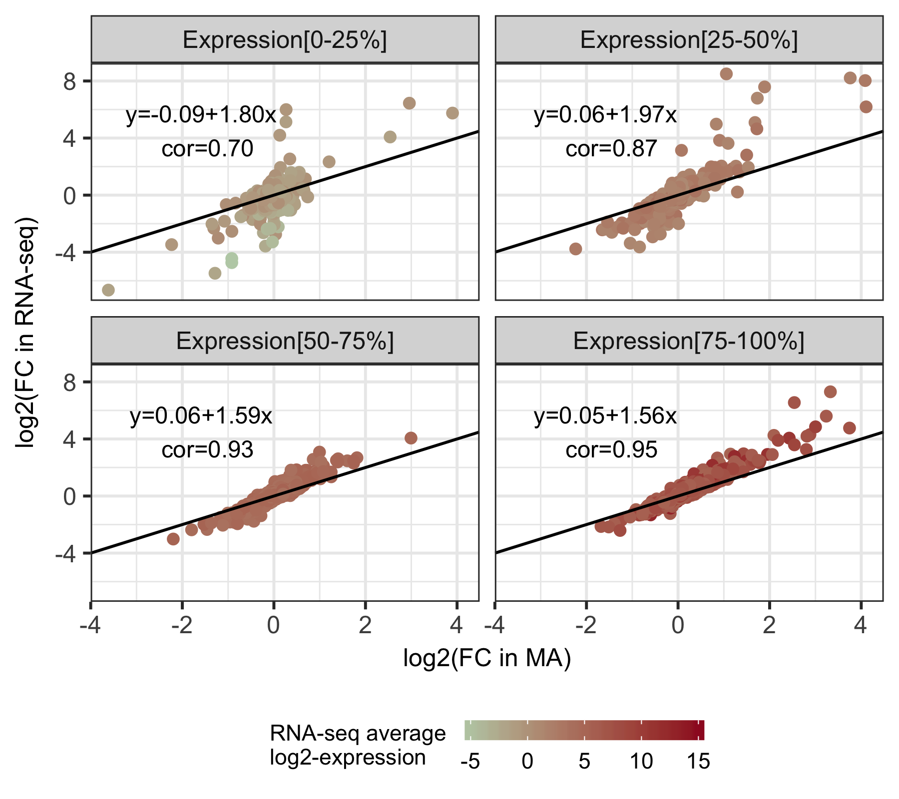

``` r
  #+ scale_color_brewer(palette = 'Set1')
```

Genes significant with MA:

``` r
ggplot(data = results_all%>%filter(!is.na(logFC_MA_limma),!is.na(logFC_RNAseq_limma),!is.na(tmp),
                                   qvalue_MA_Storey<.05),
       aes(x = logFC_MA_limma, y = logFC_RNAseq_limma, color = FD6.rnaseq.voom_mean)) +
  geom_point() +
  facet_wrap(~ tmp) +
  #geom_text(data = tmpdat,aes(x=minx,y=maxy,label=paste(lmtext,"\n",cortext)),size=3,inherit.aes = FALSE)+
  geom_abline(intercept = 0, slope = 1) +
  #ggtitle(paste0("logFC: MA vs RNA-seq by Quartiles of FD6 Expression"))+
  scale_color_gradient_tableau(name="RNA-seq\naverage \nlog2-expression")+
  #scale_color_continuous_tableau()+
  xlab("log2(FC in MA)")+ylab("log2(FC in RNA-seq)")+
  theme_bw() +theme(legend.position = "bottom")+
  guides(color=guide_colorbar(barheight=0.5))
```

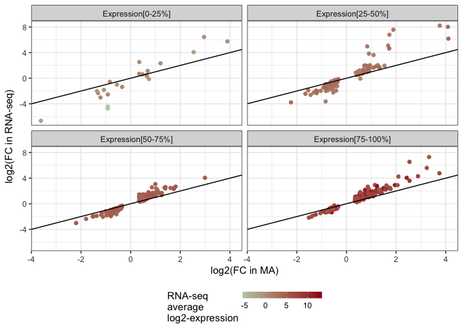

``` r
  #+ scale_color_brewer(palette = 'Set1')
```

Genes significant with RNA-seq:

``` r
ggplot(data = results_all%>%filter(!is.na(logFC_MA_limma),!is.na(logFC_RNAseq_limma),!is.na(tmp),
                                   qvalue_RNAseq_Storey<.05),
       aes(x = logFC_MA_limma, y = logFC_RNAseq_limma, color = FD6.rnaseq.voom_mean)) +
  geom_point() +
  facet_wrap(~ tmp) +
  #geom_text(data = tmpdat,aes(x=minx,y=maxy,label=paste(lmtext,"\n",cortext)),size=3,inherit.aes = FALSE)+
  geom_abline(intercept = 0, slope = 1) +
  #ggtitle(paste0("logFC: MA vs RNA-seq by Quartiles of FD6 Expression"))+
  scale_color_gradient_tableau(name="RNA-seq\naverage \nlog2-expression")+
  #scale_color_continuous_tableau()+
  xlab("log2(FC in MA)")+ylab("log2(FC in RNA-seq)")+
  theme_bw() +theme(legend.position = "bottom")+
  guides(color=guide_colorbar(barheight=0.5))
```

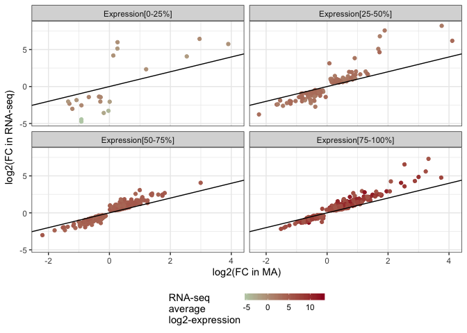

``` r
  #+ scale_color_brewer(palette = 'Set1')
```

Genes significant with both MA and RNA-seq:

``` r
ggplot(data = results_all%>%filter(!is.na(logFC_MA_limma),!is.na(logFC_RNAseq_limma),!is.na(tmp),
                                   qvalue_RNAseq_Storey<.05,
                                   qvalue_MA_Storey<.05),
       aes(x = logFC_MA_limma, y = logFC_RNAseq_limma, color = FD6.rnaseq.voom_mean)) +
  geom_point() +
  facet_wrap(~ tmp) +
  #geom_text(data = tmpdat,aes(x=minx,y=maxy,label=paste(lmtext,"\n",cortext)),size=3,inherit.aes = FALSE)+
  geom_abline(intercept = 0, slope = 1) +
  #ggtitle(paste0("logFC: MA vs RNA-seq by Quartiles of FD6 Expression"))+
  scale_color_gradient_tableau(name="RNA-seq\naverage \nlog2-expression")+
  #scale_color_continuous_tableau()+
  xlab("log2(FC in MA)")+ylab("log2(FC in RNA-seq)")+
  theme_bw() +theme(legend.position = "bottom")+
  guides(color=guide_colorbar(barheight=0.5))
```

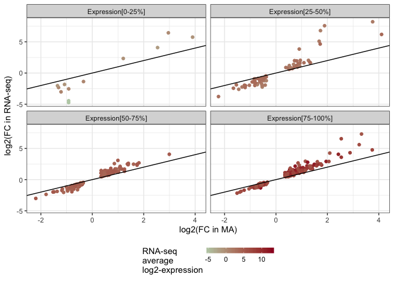

``` r
  #+ scale_color_brewer(palette = 'Set1')
```

We can show this same plot in one panel overall:

``` r
tmpdat = results_all%>%
  summarise(cor=cor(logFC_MA_limma,logFC_RNAseq_limma,use="pairwise.complete.obs"),
                                     minx = .3*min(results_all$logFC_RNAseq_limma,na.rm=T),
                                     maxy = .8*max(results_all$logFC_MA_limma,na.rm=T),
                                     cortext = sprintf("cor=%.2f",cor))

ggplot(data = results_all%>%filter(!is.na(logFC_MA_limma),!is.na(logFC_RNAseq_limma)),
       aes(x = logFC_MA_limma, y = logFC_RNAseq_limma, color = FD6.rnaseq.voom_mean)) +
  geom_point() +
  geom_text(data = tmpdat,aes(x=minx,y=maxy,label=cortext),inherit.aes = FALSE)+
  geom_abline(intercept = 0, slope = 1) +
  ggtitle(paste0("logFC: MA vs RNA-seq"))+
  scale_color_gradient_tableau(name="RNA-seq\naverage expression \nin FD6")+
  #scale_color_continuous_tableau()+
  xlab("logFC MA")+ylab("logFC RNA-seq")+
  theme_minimal() #+ scale_color_brewer(palette = 'Set1')
```

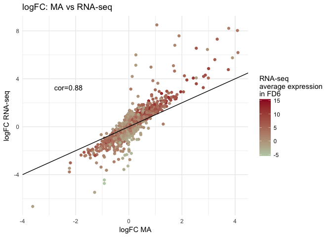

P-value plots
-------------

Comparing the correlations of p-values and q-values from the two platform analysis results, we see that they correlate well but RNA-seq has higher levels of significance in general than microarray.

``` r
tmpx = -log10(results_all$pvalue_MA)
tmpy = -log10(results_all$pvalue_RNAseq)

ggplot(data=results_all,
       aes(x=-log10(pvalue_MA),y=-log10(pvalue_RNAseq),color=FD6.rnaseq.voom_mean))+
  geom_point()+geom_abline(intercept=0,slope=1)+
  ggtitle(paste0("-log10-Pvalue MA vs RNA-seq\ncor=",
                 signif(cor(tmpx,tmpy,use="pairwise.complete.obs"),3)))+
  scale_color_gradient_tableau()+
  xlab("-log10(pvalue MA)")+ylab("-log10(pvalue RNA-seq)")+
  theme_minimal()
```

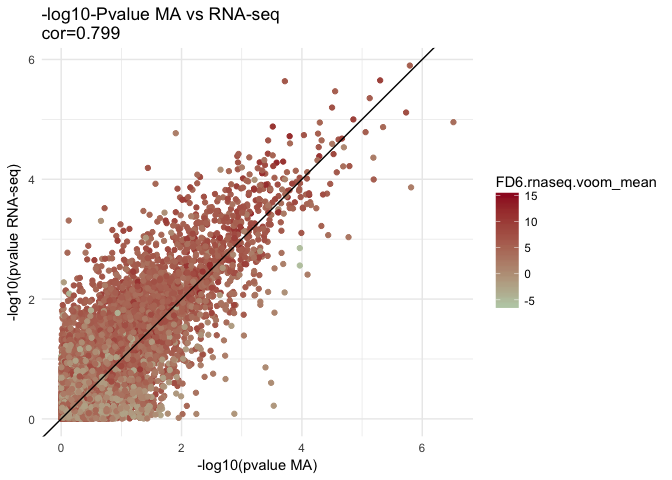

``` r
tmpx = -log10(results_all$qvalue_MA_Storey)
tmpy = -log10(results_all$qvalue_RNAseq_Storey)

ggplot(data=results_all,
       aes(x=-log10(qvalue_MA_Storey),y=-log10(qvalue_RNAseq_Storey),col=FD6.rnaseq.voom_mean))+
  geom_point()+geom_abline(intercept=0,slope=1)+
  ggtitle(paste0("-log10-Qvalue MA vs RNA-seq\ncor=",
                 signif(cor(tmpx,tmpy,use="pairwise.complete.obs"),3)))+
  scale_color_gradient_tableau()+
  xlab("-log10(qvalue MA)")+ylab("-log10(qvalue RNA-seq)")+
  theme_minimal()
```

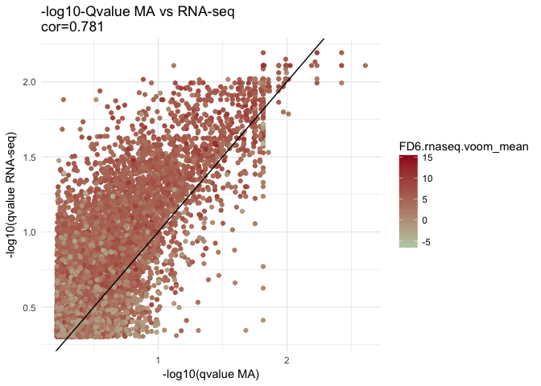

### MA Plots

MA plot of log2fc FD6 vs FN on the y-axis and average FD6 expression on the x-axis. Blue points are genes that are significant in one platform but no the other, while green points are significant in both platforms. Significance is defined as Storey q-value &lt; 0.05.

``` r
results_all$unique_id = 1:nrow(results_all)
tmpresults_all = results_all
tmpresults_all$signif_RNAseq_Storey[is.na(tmpresults_all$signif_RNAseq_Storey)] = 0
tmpresults_all$signif_MA_Storey[is.na(tmpresults_all$signif_MA_Storey)] = 0
tmpresults_all$signif_both = 2*(tmpresults_all$signif_RNAseq_Storey)+(tmpresults_all$signif_MA_Storey)
tmpresults_all$signif_both[is.na(tmpresults_all$signif_both)] = 0

tmpresults_all = tmpresults_all%>%mutate(
  signif_RNAseq_Storey_both = signif_RNAseq_Storey+signif_both,
  signif_MA_Storey_both = signif_MA_Storey+signif_both)

tmpA = tmpresults_all%>%dplyr::select(unique_id,FD6.rnaseq.voom_mean,FD6.affy.mta.rma_mean)%>%
  rename(RNAseq = FD6.rnaseq.voom_mean, MA = FD6.affy.mta.rma_mean)%>%
  gather(platform,FD6.mean,-unique_id)
tmpM = tmpresults_all%>%dplyr::select(unique_id,logFC_RNAseq_limma,logFC_MA_limma)%>%
  rename(RNAseq = logFC_RNAseq_limma, MA = logFC_MA_limma)%>%
  gather(platform,logFC,-unique_id)
# tmpS = tmpresults_all%>%select(unique_id,signif_RNAseq_Storey_both,signif_MA_Storey_both)%>%
#   rename(RNAseq = signif_RNAseq_Storey_both, MA = signif_MA_Storey_both)%>%
#   gather(platform,signif,-unique_id)
tmpS = tmpresults_all%>%dplyr::select(unique_id,signif_both)%>%
  rename(RNAseq = signif_both)%>%mutate(MA = RNAseq)%>%
  gather(platform,signif,-unique_id)

tmpdat = left_join(tmpA,tmpM)
tmpdat = left_join(tmpdat,tmpS)
#tmpdat$signif[is.na(tmpdat$signif)] = 0
tmpdat$signif = as.factor(tmpdat$signif)

p <- ggplot(tmpdat,aes(x=FD6.mean,y=logFC,col=signif,alpha=0.2))+geom_point(pch=21)+facet_grid(~platform)+
  theme_minimal()+
  scale_color_manual(name="Signifcance",values=c("darkgrey","blue","green","red"),
                     labels=c("Not Significant","Significant in Microarray","Significant in RNA-seq", "Significant in Both"))+
  scale_alpha(guide=FALSE)

p
```

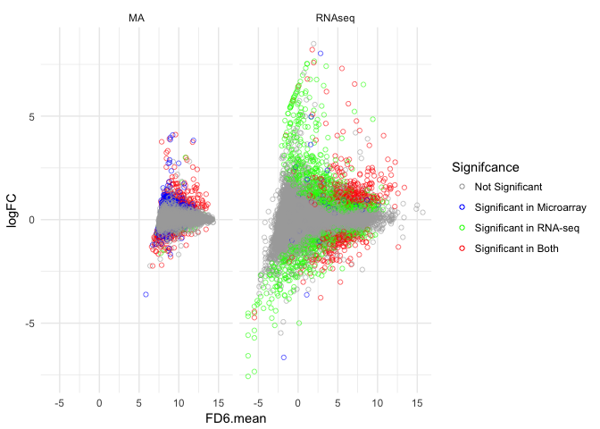

``` r
p + facet_grid(signif~platform,scales="free_x")
```

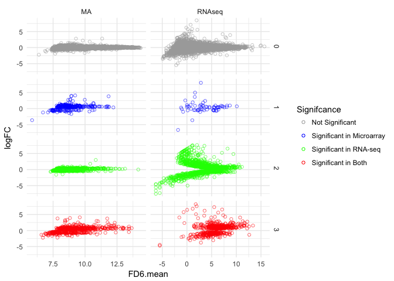

Venn Diagrams of Significance
-----------------------------

Storey's q-value &lt; 0.05

``` r
tmpind1 = with(results_all,
               which((qvalue_RNAseq_Storey<.05)))
tmpind2 = with(results_all,
               which((qvalue_MA_Storey<.05)))
plot(Venn(list("RNA-seq"=tmpind1,"MA"=tmpind2)),doWeights=TRUE)
```

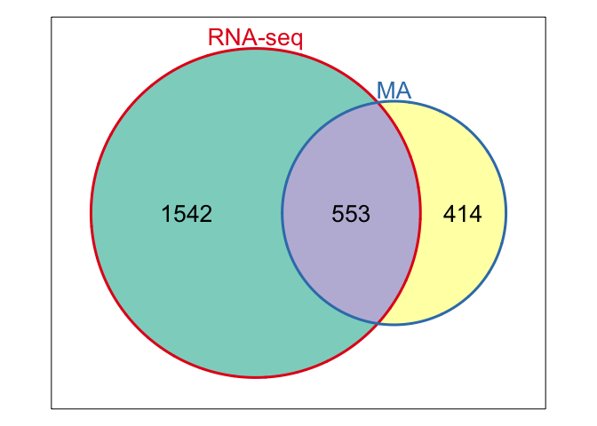 Storey's q-value &lt; 0.1

``` r
tmpind1 = with(results_all,
               which((qvalue_RNAseq_Storey<.1)))
tmpind2 = with(results_all,
               which((qvalue_MA_Storey<.1)))
plot(Venn(list("RNA-seq"=tmpind1,"MA"=tmpind2)),doWeights=TRUE)
```

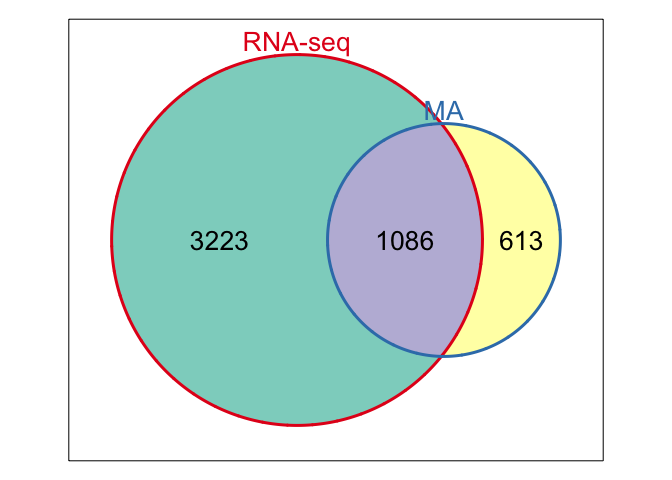

Storey's q-value &lt; 0.05 and log2FC &gt; 0.5

``` r
tmpind1 = with(results_all,
               which((abs(logFC_RNAseq_limma)>0.5)&(qvalue_RNAseq_Storey<.05)))
tmpind2 = with(results_all,
               which((abs(logFC_MA_limma)>0.5)&(qvalue_MA_Storey<.05)))
plot(Venn(list("RNA-seq"=tmpind1,"MA"=tmpind2)),doWeights=TRUE)
```

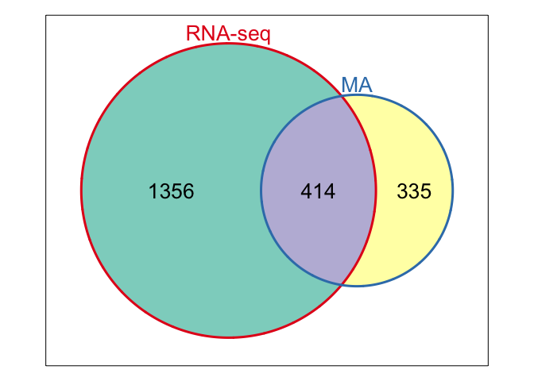

### Intersect q-value and fold change cut offs separately

``` r
tmpind1 = with(results_all,
               which((abs(logFC_RNAseq_limma)>0.5)))
tmpind2 = with(results_all,
               which((qvalue_RNAseq_Storey<0.05)))
tmpind3 = with(results_all,
               which((abs(logFC_MA_limma)>0.5)))
tmpind4 = with(results_all,
               which((qvalue_MA_Storey<0.05)))
plot(Venn(list("RNA-seq - logFC>0.5"=tmpind1,
               "RNA-seq - q<0.0.05"=tmpind2,
               "MA - logFC > 0.5"=tmpind3,
               "MA - q<0.0.05"=tmpind4)),
     doWeights=FALSE,type="ellipses")
```

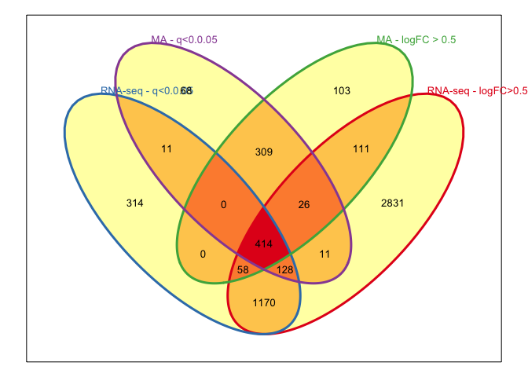

List of top genes
-----------------

Largest RNA-seq fold changes

``` r
tmpdat = results_all%>%arrange(desc(abs(logFC_RNAseq_limma)))%>%
  dplyr::select(ensembl_id,gene_name,gene_biotype,`locus type`,logFC_RNAseq_limma,logFC_MA_limma,
         pvalue_RNAseq,qvalue_RNAseq_Storey,pvalue_MA,qvalue_MA_Storey,
         FD6.rnaseq.voom_mean,FN.rnaseq.voom_mean,FD6.affy.mta.rma_mean,FN.affy.mta.rma_mean,Description)
tmpdat2 = rnaseq_counts
colnames(tmpdat2) = gsub("voom","counts",colnames(tmpdat2))

tmpdat = left_join(tmpdat,tmpdat2)

tmpdat%>%head(50)%>%kable(digits=3)
```

| ensembl\_id        | gene\_name | gene\_biotype     | locus type        |  logFC\_RNAseq\_limma|  logFC\_MA\_limma|  pvalue\_RNAseq|  qvalue\_RNAseq\_Storey|  pvalue\_MA|  qvalue\_MA\_Storey|  FD6.rnaseq.voom\_mean|  FN.rnaseq.voom\_mean|  FD6.affy.mta.rma\_mean|  FN.affy.mta.rma\_mean| Description                                | geneSymbol | entrezid  |  FD6.rnaseq.counts\_1|  FD6.rnaseq.counts\_2|  FN.rnaseq.counts\_1|  FN.rnaseq.counts\_2|
|:-------------------|:-----------|:------------------|:------------------|---------------------:|-----------------:|---------------:|-----------------------:|-----------:|-------------------:|----------------------:|---------------------:|-----------------------:|----------------------:|:-------------------------------------------|:-----------|:----------|---------------------:|---------------------:|--------------------:|--------------------:|
| ENSMUSG00000076523 | Igkv15-103 | IG\_LV\_gene      | Coding            |                 8.498|             1.055|           0.088|                   0.132|       0.037|               0.131|                  1.958|                -6.415|                   9.066|                  8.011| immunoglobulin kappa chain variable 15-103 | NA         |           |                    26|                   881|                    0|                    0|
| ENSMUSG00000076562 | Igkv4-50   | IG\_LV\_gene      | Coding            |                 8.213|             3.760|           0.000|                   0.010|       0.000|               0.004|                  1.778|                -6.415|                   7.846|                  4.086| immunoglobulin kappa variable 4-50         | NA         |           |                    95|                   190|                    0|                    0|
| ENSMUSG00000094006 | Igkv4-59   | IG\_LV\_gene      | Coding            |                 8.031|             4.087|           0.015|                   0.054|       0.002|               0.025|                  2.830|                -5.254|                   9.226|                  5.138| immunoglobulin kappa variable 4-59         | NA         |           |                   530|                   147|                    2|                    0|
| ENSMUSG00000094356 | Igkv8-28   | IG\_LV\_gene      | NA                |                 7.655|                NA|           0.000|                   0.010|          NA|                  NA|                  2.041|                -5.623|                      NA|                     NA| NA                                         | NA         |           |                   168|                   155|                    1|                    0|
| ENSMUSG00000095981 | Ighv10-1   | IG\_V\_gene       | Coding            |                 7.584|             1.890|           0.000|                   0.010|       0.000|               0.006|                  1.963|                -5.623|                   9.085|                  7.195| immunoglobulin heavy variable 10-1         | NA         |           |                   147|                   159|                    1|                    0|
| ENSMUSG00000029811 | Aoc1       | protein\_coding   | NA                |                -7.570|                NA|           0.000|                   0.012|          NA|                  NA|                 -6.298|                 1.253|                      NA|                     NA| NA                                         | Aoc1       |           |                     0|                     0|                  155|                   66|
| ENSMUSG00000076563 | Igkv5-48   | IG\_LV\_gene      | NA                |                 7.541|                NA|           0.000|                   0.008|          NA|                  NA|                  1.127|                -6.415|                      NA|                     NA| NA                                         | NA         |           |                    82|                    89|                    0|                    0|
| ENSMUSG00000076555 | Igkv4-57-1 | IG\_LV\_gene      | NA                |                 7.520|                NA|           0.001|                   0.014|          NA|                  NA|                  1.134|                -6.415|                      NA|                     NA| NA                                         | NA         |           |                   127|                    58|                    0|                    0|
| ENSMUSG00000000381 | Wap        | protein\_coding   | NA                |                 7.412|                NA|           0.011|                   0.047|          NA|                  NA|                  3.532|                -3.893|                      NA|                     NA| NA                                         | Wap        | 22373     |                   720|                   287|                    1|                    5|
| ENSMUSG00000040136 | Abcc8      | protein\_coding   | NA                |                -7.337|                NA|           0.001|                   0.017|          NA|                  NA|                 -5.506|                 1.810|                      NA|                     NA| NA                                         | Abcc8      | 20927     |                     1|                     0|                  229|                   97|
| ENSMUSG00000095753 | Igkv4-53   | IG\_LV\_gene      | NA                |                 7.323|                NA|           0.007|                   0.038|          NA|                  NA|                  0.963|                -6.415|                      NA|                     NA| NA                                         | NA         |           |                   170|                    34|                    0|                    0|
| ENSMUSG00000050578 | Mmp13      | protein\_coding   | Coding            |                 7.306|             3.327|           0.000|                   0.010|       0.000|               0.006|                  5.521|                -1.767|                   8.604|                  5.277| matrix metallopeptidase 13                 | Mmp13      | 17386     |                  1441|                  2262|                    8|                   18|
| ENSMUSG00000076652 | Ighv7-3    | IG\_V\_gene       | NA                |                 7.097|                NA|           0.013|                   0.050|          NA|                  NA|                  0.745|                -6.415|                      NA|                     NA| NA                                         | NA         |           |                   170|                    25|                    0|                    0|
| ENSMUSG00000076586 | Igkv8-21   | IG\_LV\_gene      | NA                |                 6.978|                NA|           0.000|                   0.010|          NA|                  NA|                  0.570|                -6.415|                      NA|                     NA| NA                                         | NA         |           |                    61|                    55|                    0|                    0|
| ENSMUSG00000104422 | Ighv1-14   | IG\_V\_pseudogene | Coding            |                 6.797|             1.731|           0.000|                   0.010|       0.000|               0.015|                  1.168|                -5.623|                   9.252|                  7.521| immunoglobulin heavy variable 1-14         | NA         |           |                    75|                   103|                    1|                    0|
| ENSMUSG00000076671 | Ighv13-2   | IG\_V\_gene       | NA                |                 6.777|                NA|           0.000|                   0.012|          NA|                  NA|                  1.514|                -5.254|                      NA|                     NA| NA                                         | NA         |           |                    92|                   136|                    0|                    2|
| ENSMUSG00000096490 | Igkv10-94  | IG\_LV\_gene      | NA                |                 6.768|                NA|           0.003|                   0.027|          NA|                  NA|                  2.331|                -4.462|                      NA|                     NA| NA                                         | NA         |           |                   253|                   154|                    7|                    0|
| ENSMUSG00000095200 | Ighv1-7    | IG\_V\_gene       | NA                |                 6.675|                NA|           0.000|                   0.012|          NA|                  NA|                  0.284|                -6.415|                      NA|                     NA| NA                                         | NA         |           |                    66|                    34|                    0|                    0|
| ENSMUSG00000029378 | Areg       | protein\_coding   | Coding            |                -6.656|            -3.615|           0.028|                   0.073|       0.001|               0.022|                 -1.805|                 4.804|                   5.858|                  9.473| amphiregulin                               | Areg       | 11839     |                    19|                     6|                 2460|                  577|
| ENSMUSG00000078949 | R3hdml     | protein\_coding   | NA                |                -6.575|                NA|           0.007|                   0.037|          NA|                  NA|                 -6.298|                 0.238|                      NA|                     NA| NA                                         | R3hdml     | 100043899 |                     0|                     0|                  123|                   20|
| ENSMUSG00000040026 | Saa3       | protein\_coding   | Multiple\_Complex |                 6.551|             2.539|           0.001|                   0.017|       0.000|               0.015|                  7.119|                 0.562|                   9.451|                  6.912| serum amyloid A 3                          | Saa3       | 20210     |                  3148|                  9502|                   63|                   62|
| ENSMUSG00000095079 | Igha       | IG\_C\_gene       | NA                |                 6.528|                NA|           0.000|                   0.012|          NA|                  NA|                  8.221|                 1.663|                      NA|                     NA| NA                                         | NA         |           |                 16397|                  8406|                  287|                   63|
| ENSMUSG00000095519 | Ighv1-66   | IG\_LV\_gene      | NA                |                 6.489|                NA|           0.001|                   0.014|          NA|                  NA|                  0.101|                -6.415|                      NA|                     NA| NA                                         | NA         |           |                    62|                    28|                    0|                    0|
| ENSMUSG00000028238 | Atp6v0d2   | protein\_coding   | NA                |                 6.475|                NA|           0.000|                   0.010|          NA|                  NA|                  3.219|                -3.245|                      NA|                     NA| NA                                         | Atp6v0d2   | 242341    |                   302|                   443|                    4|                    4|
| ENSMUSG00000076552 | Igkv4-61   | IG\_LV\_gene      | Coding            |                 6.445|             2.958|           0.000|                   0.010|       0.002|               0.029|                  0.038|                -6.415|                   8.449|                  5.491| immunoglobulin kappa chain variable 4-61   | NA         |           |                    43|                    37|                    0|                    0|
| ENSMUSG00000096670 | Ighv2-6    | IG\_V\_gene       | NA                |                 6.400|                NA|           0.000|                   0.010|          NA|                  NA|                 -0.028|                -6.415|                      NA|                     NA| NA                                         | NA         |           |                    29|                    50|                    0|                    0|
| ENSMUSG00000096833 | Igkv4-55   | IG\_LV\_gene      | NA                |                 6.302|                NA|           0.009|                   0.043|          NA|                  NA|                 -0.055|                -6.415|                      NA|                     NA| NA                                         | NA         |           |                    92|                    15|                    0|                    0|
| ENSMUSG00000076522 | Igkv16-104 | IG\_LV\_gene      | NA                |                 6.204|                NA|           0.027|                   0.072|          NA|                  NA|                 -0.134|                -6.415|                      NA|                     NA| NA                                         | NA         |           |                   122|                    10|                    0|                    0|
| ENSMUSG00000095642 | Ighv14-3   | IG\_V\_gene       | NA                |                 6.200|                NA|           0.003|                   0.028|          NA|                  NA|                  0.979|                -5.254|                      NA|                     NA| NA                                         | NA         |           |                   121|                    49|                    2|                    0|
| ENSMUSG00000059654 | Reg1       | protein\_coding   | Coding            |                 6.187|             4.107|           0.000|                   0.008|       0.000|               0.002|                  3.575|                -2.611|                   9.587|                  5.480| regenerating islet-derived 1               | Reg1       | 19692     |                   430|                   510|                    7|                    6|
| ENSMUSG00000096459 | Ighv9-3    | IG\_V\_gene       | NA                |                 6.152|                NA|           0.005|                   0.031|          NA|                  NA|                 -0.216|                -6.415|                      NA|                     NA| NA                                         | NA         |           |                    69|                    16|                    0|                    0|
| ENSMUSG00000095442 | Ighv1-4    | IG\_V\_gene       | NA                |                 6.114|                NA|           0.007|                   0.039|          NA|                  NA|                  0.902|                -5.254|                      NA|                     NA| NA                                         | NA         |           |                   133|                    40|                    2|                    0|
| ENSMUSG00000102524 | Ighv1-2    | IG\_V\_pseudogene | NA                |                 6.092|                NA|           0.000|                   0.012|          NA|                  NA|                 -0.303|                -6.415|                      NA|                     NA| NA                                         | NA         |           |                    41|                    24|                    0|                    0|
| ENSMUSG00000076556 | Igkv4-57   | IG\_LV\_gene      | NA                |                 6.071|                NA|           0.000|                   0.011|          NA|                  NA|                  0.440|                -5.623|                      NA|                     NA| NA                                         | NA         |           |                    43|                    65|                    1|                    0|
| ENSMUSG00000094164 | Ighv2-3    | IG\_V\_gene       | Coding            |                 5.995|             0.267|           0.000|                   0.012|       0.019|               0.097|                 -0.400|                -6.415|                   8.595|                  8.329| Ighv2-3 immunoglobulin heavy variable 2-3  | NA         |           |                    39|                    22|                    0|                    0|
| ENSMUSG00000054510 | Gm14461    | lincRNA           | NA                |                 5.917|                NA|           0.000|                   0.010|          NA|                  NA|                 -0.502|                -6.415|                      NA|                     NA| NA                                         | NA         |           |                    24|                    31|                    0|                    0|
| ENSMUSG00000094345 | Igkv14-126 | IG\_LV\_gene      | NA                |                 5.902|                NA|           0.006|                   0.036|          NA|                  NA|                 -0.563|                -6.415|                      NA|                     NA| NA                                         | NA         |           |                    10|                    67|                    0|                    0|
| ENSMUSG00000039691 | Tspan10    | protein\_coding   | NA                |                 5.899|                NA|           0.000|                   0.011|          NA|                  NA|                  1.428|                -4.462|                      NA|                     NA| NA                                         | Tspan10    | 208634    |                    86|                   129|                    1|                    2|
| ENSMUSG00000095633 | Igkv4-58   | IG\_LV\_gene      | NA                |                 5.813|                NA|           0.000|                   0.010|          NA|                  NA|                 -0.604|                -6.415|                      NA|                     NA| NA                                         | NA         |           |                    23|                    28|                    0|                    0|
| ENSMUSG00000076545 | Igkv4-72   | IG\_LV\_gene      | NA                |                 5.790|                NA|           0.101|                   0.142|          NA|                  NA|                  1.054|                -4.830|                      NA|                     NA| NA                                         | NA         |           |                   325|                    20|                    4|                    0|
| ENSMUSG00000095612 | Ighv5-4    | IG\_V\_gene       | NA                |                 5.764|                NA|           0.005|                   0.033|          NA|                  NA|                 -0.605|                -6.415|                      NA|                     NA| NA                                         | NA         |           |                    53|                    12|                    0|                    0|
| ENSMUSG00000076540 | Igkv4-80   | IG\_LV\_gene      | Coding            |                 5.751|             3.901|           0.000|                   0.010|       0.001|               0.016|                 -0.668|                -6.415|                   8.818|                  4.918| immunoglobulin kappa variable 4-80         | NA         |           |                    21|                    28|                    0|                    0|
| ENSMUSG00000094930 | Igkv6-25   | IG\_LV\_gene      | NA                |                 5.740|                NA|           0.017|                   0.058|          NA|                  NA|                  0.174|                -5.623|                      NA|                     NA| NA                                         | NA         |           |                   106|                    18|                    0|                    1|
| ENSMUSG00000031936 | Hephl1     | protein\_coding   | NA                |                 5.713|                NA|           0.001|                   0.014|          NA|                  NA|                 -0.679|                -6.415|                      NA|                     NA| NA                                         | Hephl1     | 244698    |                    34|                    17|                    0|                    0|
| ENSMUSG00000022435 | Upk3a      | protein\_coding   | NA                |                -5.708|                NA|           0.001|                   0.018|          NA|                  NA|                 -5.506|                 0.186|                      NA|                     NA| NA                                         | Upk3a      | 22270     |                     1|                     0|                   72|                   32|
| ENSMUSG00000095351 | Igkv3-2    | IG\_LV\_gene      | NA                |                 5.640|                NA|           0.001|                   0.016|          NA|                  NA|                  0.038|                -5.623|                      NA|                     NA| NA                                         | NA         |           |                    53|                    30|                    1|                    0|
| ENSMUSG00000094124 | Ighv1-74   | IG\_LV\_gene      | NA                |                 5.638|                NA|           0.001|                   0.018|          NA|                  NA|                 -0.806|                -6.415|                      NA|                     NA| NA                                         | NA         |           |                    12|                    40|                    0|                    0|
| ENSMUSG00000067149 | Jchain     | protein\_coding   | Coding            |                 5.599|             3.236|           0.001|                   0.015|       0.000|               0.015|                  6.328|                 0.718|                   8.439|                  5.202| immunoglobulin joining chain               | Jchain     | 16069     |                  4329|                  2306|                   97|                   50|
| ENSMUSG00000022056 | Adam7      | protein\_coding   | NA                |                -5.582|                NA|           0.000|                   0.012|          NA|                  NA|                 -6.298|                -0.703|                      NA|                     NA| NA                                         | Adam7      | 11500     |                     0|                     0|                   20|                   33|
| ENSMUSG00000095204 | Ighv1-52   | IG\_V\_gene       | NA                |                 5.573|                NA|           0.002|                   0.020|          NA|                  NA|                 -0.073|                -5.623|                      NA|                     NA| NA                                         | NA         |           |                    23|                    59|                    0|                    1|

``` r
write_csv(tmpdat,path="results_by_rnaseqfc.csv")
```

Pathway Analysis
================

``` r
# need entrez geneids

tmpentrez <- AnnotationDbi::mapIds(org.Mm.eg.db,keys=results_rnaseq$ensembl_id,
                               keytype="ENSEMBL",
                               column="ENTREZID",multiVals = "asNA")
tmpentrez_de = tmpentrez[results_rnaseq$signif_RNAseq_Storey==1]
go_RNAseq <- goana(de = tmpentrez_de,
               universe = tmpentrez, species="Mm")
topgo_RNAseq = topGO(go_RNAseq,number=Inf)
topgo_RNAseq = rownames_to_column(topgo_RNAseq,"goid")

topgo_RNAseq_BP = topGO(go_RNAseq,number=Inf,ontology = "BP")
topgo_RNAseq_BP = rownames_to_column(topgo_RNAseq_BP,"goid")

tmpkey= results_MA$ENSEMBL
tmpkey[is.na(tmpkey)] = "1"
tmpentrez1 <- AnnotationDbi::mapIds(org.Mm.eg.db,keys=tmpkey,
                               keytype="ENSEMBL",
                               column="ENTREZID",multiVals = "first")

tmpkey= results_MA$`Gene Symbol`
tmpkey[is.na(tmpkey)] = "1"
tmpentrez2 <- AnnotationDbi::mapIds(org.Mm.eg.db,keys=tmpkey,
                               keytype="SYMBOL",
                               column="ENTREZID",multiVals = "first")
tmpentrez2[is.na(tmpentrez2)] = tmpentrez1[is.na(tmpentrez2)]

tmpentrez2_de = tmpentrez2[results_MA$signif_MA_Storey==1]
go_MA <- goana(de = tmpentrez2_de,
               universe = tmpentrez2, species="Mm")
topgo_MA = topGO(go_MA,number=Inf)
topgo_MA = rownames_to_column(topgo_MA,"goid")

topgo_MA_BP = topGO(go_MA,number=Inf,ontology = "BP")
topgo_MA_BP = rownames_to_column(topgo_MA_BP,"goid")
```

Top 10 RNA-seq GO pathways

``` r
head(topgo_RNAseq_BP,n=10)%>%kable
```

| goid         | Term                                           | Ont |     N|    DE|  P.DE|
|:-------------|:-----------------------------------------------|:----|-----:|-----:|-----:|
| <GO:0009605> | response to external stimulus                  | BP  |  1406|   298|     0|
| <GO:0050896> | response to stimulus                           | BP  |  5529|   904|     0|
| <GO:0042221> | response to chemical                           | BP  |  2518|   467|     0|
| <GO:0006952> | defense response                               | BP  |   942|   214|     0|
| <GO:0044707> | single-multicellular organism process          | BP  |  4583|   761|     0|
| <GO:0032501> | multicellular organismal process               | BP  |  4881|   801|     0|
| <GO:0044699> | single-organism process                        | BP  |  9343|  1385|     0|
| <GO:0002376> | immune system process                          | BP  |  1688|   331|     0|
| <GO:0007166> | cell surface receptor signaling pathway        | BP  |  1806|   349|     0|
| <GO:0051239> | regulation of multicellular organismal process | BP  |  2223|   409|     0|

Top 10 Micorarray GO pathways

``` r
head(topgo_MA_BP,n=10)%>%kable
```

| goid         | Term                                       | Ont |     N|   DE|  P.DE|
|:-------------|:-------------------------------------------|:----|-----:|----:|-----:|
| <GO:0006955> | immune response                            | BP  |   501|   82|     0|
| <GO:0009605> | response to external stimulus              | BP  |   840|  116|     0|
| <GO:0006952> | defense response                           | BP  |   532|   82|     0|
| <GO:0002376> | immune system process                      | BP  |   989|  126|     0|
| <GO:0030574> | collagen catabolic process                 | BP  |    16|   11|     0|
| <GO:0050896> | response to stimulus                       | BP  |  3235|  307|     0|
| <GO:0042742> | defense response to bacterium              | BP  |    87|   25|     0|
| <GO:0098542> | defense response to other organism         | BP  |   180|   38|     0|
| <GO:0044243> | multicellular organismal catabolic process | BP  |    18|   11|     0|
| <GO:0060326> | cell chemotaxis                            | BP  |   114|   28|     0|

Venn diagram of GO pathways with p-value &lt; 0.05 in each platform:

``` r
tmpind1 = topgo_RNAseq_BP$goid[which(topgo_RNAseq_BP$P.DE<.05)]
tmpind2 = topgo_MA_BP$goid[which(topgo_MA_BP$P.DE<.05)]

plot(Venn(list("RNA-seq"=tmpind1,"    MA"=tmpind2)),doWeights=TRUE)
```

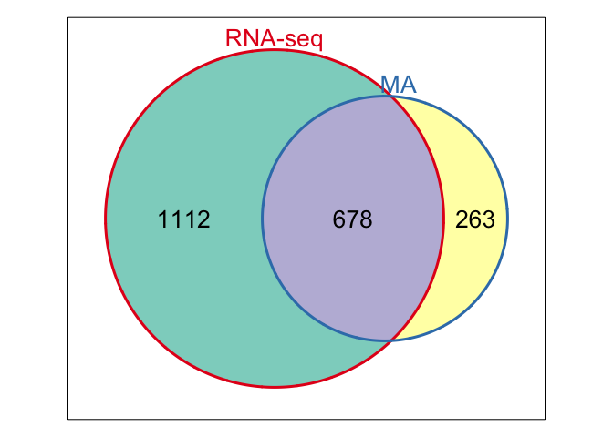

Top 10 GO terms significant in RNA-seq but not micorarray:

``` r
topgo_RNAseq_signif = topgo_RNAseq_BP[which(topgo_RNAseq_BP$P.DE<.05),]
topgo_MA_signif = topgo_MA_BP[which(topgo_MA_BP$P.DE<.05),]
length(topgo_RNAseq_signif$goid)
```

    ## [1] 1790

``` r
length(topgo_MA_signif$goid)
```

    ## [1] 941

``` r
length(intersect(topgo_MA_signif$goid,topgo_RNAseq_signif$goid))
```

    ## [1] 678

``` r
topgo_RNAseq_signif%>%filter(!(goid%in%topgo_MA_signif$goid))%>%head(.,n=10)%>%kable
```

| goid         | Term                                       | Ont |     N|    DE|     P.DE|
|:-------------|:-------------------------------------------|:----|-----:|-----:|--------:|
| <GO:0007275> | multicellular organism development         | BP  |  3848|   605|  1.0e-07|
| <GO:0006810> | transport                                  | BP  |  3457|   546|  2.0e-07|
| <GO:0051604> | protein maturation                         | BP  |   198|    52|  6.0e-07|
| <GO:0050764> | regulation of phagocytosis                 | BP  |    76|    27|  6.0e-07|
| <GO:1901700> | response to oxygen-containing compound     | BP  |  1018|   185|  2.0e-06|
| <GO:0065007> | biological regulation                      | BP  |  8135|  1167|  2.3e-06|
| <GO:0051234> | establishment of localization              | BP  |  3596|   557|  2.4e-06|
| <GO:0009967> | positive regulation of signal transduction | BP  |  1132|   201|  3.5e-06|
| <GO:0010647> | positive regulation of cell communication  | BP  |  1250|   218|  4.8e-06|
| <GO:0023056> | positive regulation of signaling           | BP  |  1258|   219|  5.2e-06|

Top 10 GO terms significant in RNA-seq but not micorarray:

``` r
topgo_MA_signif%>%filter(!(goid%in%topgo_RNAseq_signif$goid))%>%head(.,n=10)%>%kable
```

| goid         | Term                                                           | Ont |    N|   DE|       P.DE|
|:-------------|:---------------------------------------------------------------|:----|----:|----:|----------:|
| <GO:0002440> | production of molecular mediator of immune response            | BP  |   89|   21|  0.0000012|
| <GO:0002377> | immunoglobulin production                                      | BP  |   55|   15|  0.0000060|
| <GO:0050853> | B cell receptor signaling pathway                              | BP  |   27|   10|  0.0000111|
| <GO:0019724> | B cell mediated immunity                                       | BP  |   57|   13|  0.0001868|
| <GO:0008037> | cell recognition                                               | BP  |   57|   13|  0.0001868|
| <GO:0016064> | immunoglobulin mediated immune response                        | BP  |   57|   13|  0.0001868|
| <GO:0072674> | multinuclear osteoclast differentiation                        | BP  |    3|    3|  0.0003918|
| <GO:0072675> | osteoclast fusion                                              | BP  |    3|    3|  0.0003918|
| <GO:0002455> | humoral immune response mediated by circulating immunoglobulin | BP  |   33|    9|  0.0004482|
| <GO:0050871> | positive regulation of B cell activation                       | BP  |   42|   10|  0.0007125|

``` r
# how to deal with duplicate transcript cluster ids
# full join likely duplicating some results
# add basic pathway analysis
```

Table of Results Comparisons
============================

``` r
results_MA$coding_MA = 1*(results_MA$`locus type`%in%c("Coding","Multiple_Complex"))
results_rnaseq$coding_RNAseq = 1*(results_rnaseq$gene_biotype%in%c("protein_coding"))
results_rnaseq_full$coding_RNAseq = 1*(results_rnaseq_full$gene_biotype%in%c("protein_coding"))
results_MA_full$coding_MA = 1*(results_MA_full$`locus type`%in%c("Coding","Multiple_Complex"))

results_all_intersect = results_all%>%filter((!is.na(logFC_RNAseq_limma))&(!is.na(logFC_MA_limma)))
results_all_intersect$coding_MA = 1*(results_all_intersect$`locus type`%in%c("Coding","Multiple_Complex"))
results_all_intersect$coding_RNAseq = 1*(results_all_intersect$gene_biotype%in%c("protein_coding"))

results_all$coding_MA = 1*(results_all$`locus type`%in%c("Coding","Multiple_Complex"))
results_all$coding_RNAseq = 1*(results_all$gene_biotype%in%c("protein_coding"))

#table(results_all_intersect$coding_MA,results_all_intersect$coding_RNAseq)

tab_summary = rbind(
  "# genes discovered"= paste0(
                            c(sum(results_MA_full$coding_MA),sum(results_rnaseq_full$coding_RNAseq),
                          sum(results_rnaseq_full$coding_RNAseq,na.rm=T)),
                          " (",
c(sum(results_MA_full$`locus type`!="---",na.rm=T),nrow(results_rnaseq_full),
                          sum(!is.na(results_rnaseq_full$transcript_cluster_id))),
  ")"),
  "# genes after filtering" = paste0(
        c(sum(results_MA$coding_MA),sum(results_rnaseq$coding_RNAseq),
      sum((results_all$coding_MA==1)*(!is.na(results_all$logFC_RNAseq_limma))*(!is.na(results_all$logFC_MA_limma)))),
    " (", 
    c(nrow(results_MA),nrow(results_rnaseq),
      sum((!is.na(results_all$logFC_RNAseq_limma))*(!is.na(results_all$logFC_MA_limma)))),
    ")"),
  "# DE genes FDR 5%" = paste0( c(sum(results_MA$qvalue_MA_Storey[results_MA$coding_MA==1]<.05),
                       sum(results_rnaseq$qvalue_RNAseq_Storey[results_rnaseq$coding_RNAseq==1]<.05),
                       sum((results_all$qvalue_MA_Storey<.05)*(results_all$qvalue_RNAseq_Storey<.05)*(results_all$coding_MA==1),
                           na.rm=T))," (", 
                                c(sum(results_MA$qvalue_MA_Storey<.05),
                       sum(results_rnaseq$qvalue_RNAseq_Storey<.05),
                       sum((results_all$qvalue_MA_Storey<.05)*(results_all$qvalue_RNAseq_Storey<.05),
                           na.rm=T)), 
                                
                                 ")"),
  "# DE genes FDR 5% & log2FC > 0.5" = paste0(
    c(sum((results_MA$qvalue_MA_Storey<.05)*(abs(results_MA$logFC_MA_limma)>0.5)*(results_MA$coding_MA==1)),
      sum((results_rnaseq$qvalue_RNAseq_Storey<.05)*(abs(results_rnaseq$logFC_RNAseq_limma)>0.5)*(results_rnaseq$coding_RNAseq==1)),
      sum((results_all$qvalue_MA_Storey<.05)*(results_all$qvalue_RNAseq_Storey<.05)*
            (abs(results_all$logFC_MA_limma)>0.5)*
            (abs(results_all$logFC_MA_limma)>0.5)*
        (results_all$coding_MA==1),na.rm=T)),
     " (",    
     c(sum((results_MA$qvalue_MA_Storey<.05)*(abs(results_MA$logFC_MA_limma)>0.5)),
      sum((results_rnaseq$qvalue_RNAseq_Storey<.05)*(abs(results_rnaseq$logFC_RNAseq_limma)>0.5)),
      sum((results_all$qvalue_MA_Storey<.05)*(results_all$qvalue_RNAseq_Storey<.05)*
            (abs(results_all$logFC_MA_limma)>0.5)*
            (abs(results_all$logFC_MA_limma)>0.5),na.rm=T)), 
     ")"),
    "# DE genes FDR 5% (subset of 8199 genes on both platforms)" =
    paste0(
           c(sum(results_all_intersect$qvalue_MA_Storey[results_all_intersect$coding_MA==1]<.05),
                       sum(results_all_intersect$qvalue_RNAseq_Storey[results_all_intersect$coding_RNAseq==1]<.05),
                       sum(
                         (results_all_intersect$qvalue_MA_Storey<.05)*
                           (results_all_intersect$qvalue_RNAseq_Storey<.05)*
                           (results_all_intersect$coding_MA==1),
                           na.rm=T)),
           " (",
           c(sum(results_all_intersect$qvalue_MA_Storey<.05),
                       sum(results_all_intersect$qvalue_RNAseq_Storey<.05),
                       sum((results_all_intersect$qvalue_MA_Storey<.05)*(results_all_intersect$qvalue_RNAseq_Storey<.05),
                           na.rm=T))
           ,")"),
    "# DE genes FDR 5% & log2FC > 0.5 (subset of 8199 genes on both platforms)" = 
    paste0(
    c(sum((results_all_intersect$qvalue_MA_Storey<.05)*(abs(results_all_intersect$logFC_MA_limma)>0.5)*(results_all_intersect$coding_MA==1)),
      sum((results_all_intersect$qvalue_RNAseq_Storey<.05)*(abs(results_all_intersect$logFC_RNAseq_limma)>0.5)*(results_all_intersect$coding_RNAseq==1)),
      sum((results_all_intersect$qvalue_MA_Storey<.05)*(results_all_intersect$qvalue_RNAseq_Storey<.05)*
            (abs(results_all_intersect$logFC_MA_limma)>0.5)*
            (abs(results_all_intersect$logFC_MA_limma)>0.5)*
            (results_all_intersect$coding_MA==1),na.rm=T)),
    " (",
    c(sum((results_all_intersect$qvalue_MA_Storey<.05)*(abs(results_all_intersect$logFC_MA_limma)>0.5)),
      sum((results_all_intersect$qvalue_RNAseq_Storey<.05)*(abs(results_all_intersect$logFC_RNAseq_limma)>0.5)),
      sum((results_all_intersect$qvalue_MA_Storey<.05)*(results_all_intersect$qvalue_RNAseq_Storey<.05)*
            (abs(results_all_intersect$logFC_MA_limma)>0.5)*
            (abs(results_all_intersect$logFC_MA_limma)>0.5),na.rm=T)),
     ")"),
  
  "# GO terms identified" = 
    c(nrow(topgo_MA_BP),nrow(topgo_RNAseq_BP),length(intersect(topgo_MA_BP$goid,topgo_RNAseq_BP$goid))),
    "# GO terms significant" = 
    c(sum(topgo_MA_BP$P.DE<.05),sum(topgo_RNAseq_BP$P.DE<.05),length(intersect(topgo_MA_signif$goid,topgo_RNAseq_signif$goid)))
    
)
colnames(tab_summary) = c("MA","RNA-seq","Overlap")
kable(tab_summary)
```

|                                                                               | MA            | RNA-seq       | Overlap       |
|-------------------------------------------------------------------------------|:--------------|:--------------|:--------------|
| \# genes discovered                                                           | 26596 (65956) | 22001 (45706) | 22001 (37921) |
| \# genes after filtering                                                      | 9262 (13230)  | 14554 (16696) | 8254 (8520)   |
| \# DE genes FDR 5%                                                            | 671 (962)     | 1918 (2095)   | 550 (553)     |
| \# DE genes FDR 5% & log2FC &gt; 0.5                                          | 484 (745)     | 1595 (1770)   | 411 (414)     |
| \# DE genes FDR 5% (subset of 8199 genes on both platforms)                   | 612 (617)     | 1241 (1268)   | 550 (553)     |
| \# DE genes FDR 5% & log2FC &gt; 0.5 (subset of 8199 genes on both platforms) | 441 (446)     | 956 (983)     | 411 (414)     |
| \# GO terms identified                                                        | 12938         | 14805         | 12916         |
| \# GO terms significant                                                       | 941           | 1790          | 678           |

Distribution of expresson/FC in all genes:

``` r
results_all_full%>%rownames_to_column("id")%>%
  dplyr::select(id,logFC_RNAseq_limma,logFC_MA_limma,FD6FN.rnaseq.voom_mean,FD6FN.affy.mta.rma_mean)%>%
  gather(key=key,value=value,-id)%>%group_by(key)%>%
  summarize_at(vars(value),.funs=funs(mean,median,min,max,IQR25=quantile(.,.25,na.rm=TRUE),
                       IQR75=quantile(.,.75,na.rm=TRUE)),na.rm=TRUE)%>%kable(digits=2)
```

| key                      |  mean|  median|    min|    max|  IQR25|  IQR75|
|:-------------------------|-----:|-------:|------:|------:|------:|------:|
| FD6FN.affy.mta.rma\_mean |  9.09|    8.72|   5.97|  14.41|   8.14|   9.64|
| FD6FN.rnaseq.voom\_mean  |  3.11|    3.61|  -4.13|  15.52|   0.63|   5.40|
| logFC\_MA\_limma         |  0.03|    0.00|  -3.62|   4.11|  -0.12|   0.12|
| logFC\_RNAseq\_limma     |  0.04|   -0.01|  -7.57|   8.50|  -0.26|   0.27|

``` r
summary(results_all_full%>%dplyr::select(FD6.rnaseq.voom_1,FD6.rnaseq.voom_2,
                                  FN.rnaseq.voom_1,FN.rnaseq.voom_2)%>%unlist)
```

    ##    Min. 1st Qu.  Median    Mean 3rd Qu.    Max.    NA's 
    ##   -6.48    0.69    3.62    3.11    5.41   15.91  260536

``` r
summary(results_all_full%>%dplyr::select(FD6.affy.mta.rma_1,FD6.affy.mta.rma_2,
                                        FN.affy.mta.rma_1,FN.affy.mta.rma_2)%>%unlist)
```

    ##    Min. 1st Qu.  Median    Mean 3rd Qu.    Max.    NA's 
    ##    3.93    8.15    8.73    9.09    9.65   14.48  273308

Distribution of expresson/FC in genes significant in MA:

``` r
results_all_full%>%filter(qvalue_MA_Storey<.05)%>%rownames_to_column("id")%>%
  mutate(abslogFC_RNAseq_limma = abs(logFC_RNAseq_limma),
         abslogFC_MA_limma = abs(logFC_MA_limma))%>%
  dplyr::select(id,logFC_RNAseq_limma,logFC_MA_limma,
         abslogFC_RNAseq_limma,abslogFC_MA_limma,
         FD6FN.rnaseq.voom_mean,FD6FN.affy.mta.rma_mean)%>%
  gather(key=key,value=value,-id)%>%group_by(key)%>%
  summarize_at(vars(value),
               .funs=funs(mean,median,min,max,IQR25=quantile(.,.25,na.rm=TRUE),
                          IQR75=quantile(.,.75,na.rm=TRUE)),na.rm=TRUE)%>%kable(digits=2)
```

| key                      |  mean|  median|    min|    max|  IQR25|  IQR75|
|:-------------------------|-----:|-------:|------:|------:|------:|------:|
| abslogFC\_MA\_limma      |  0.80|    0.70|   0.33|   4.11|   0.51|   0.88|
| abslogFC\_RNAseq\_limma  |  1.33|    1.04|   0.07|   8.21|   0.75|   1.51|
| FD6FN.affy.mta.rma\_mean |  8.86|    8.54|   5.97|  13.66|   8.08|   9.44|
| FD6FN.rnaseq.voom\_mean  |  5.37|    5.58|  -3.58|  13.28|   4.10|   6.77|
| logFC\_MA\_limma         |  0.42|    0.61|  -3.62|   4.11|  -0.39|   0.85|
| logFC\_RNAseq\_limma     |  0.49|    0.76|  -6.66|   8.21|  -0.74|   1.27|

Distribution of expresson/FC in genes significant in RNA-seq:

``` r
results_all_full%>%filter(qvalue_RNAseq_Storey<.05)%>%rownames_to_column("id")%>%
    mutate(abslogFC_RNAseq_limma = abs(logFC_RNAseq_limma),
         abslogFC_MA_limma = abs(logFC_MA_limma))%>%
  dplyr::select(id,logFC_RNAseq_limma,logFC_MA_limma,
         abslogFC_RNAseq_limma,abslogFC_MA_limma,
         FD6FN.rnaseq.voom_mean,FD6FN.affy.mta.rma_mean)%>%
  gather(key=key,value=value,-id)%>%group_by(key)%>%
  summarize_at(vars(value),
               .funs=funs(mean,median,min,max,IQR25=quantile(.,.25,na.rm=TRUE),
                       IQR75=quantile(.,.75,na.rm=TRUE)),na.rm=TRUE)%>%kable(digits=3)
```

| key                      |   mean|  median|     min|     max|   IQR25|  IQR75|
|:-------------------------|------:|-------:|-------:|-------:|-------:|------:|
| abslogFC\_MA\_limma      |  0.521|   0.403|   0.009|   4.107|   0.264|  0.635|
| abslogFC\_RNAseq\_limma  |  1.385|   0.938|   0.331|   8.213|   0.614|  1.690|
| FD6FN.affy.mta.rma\_mean |  9.007|   8.774|   5.966|  14.159|   8.164|  9.555|
| FD6FN.rnaseq.voom\_mean  |  3.879|   4.410|  -4.037|  13.282|   2.088|  5.910|
| logFC\_MA\_limma         |  0.152|   0.216|  -2.235|   4.107|  -0.327|  0.492|
| logFC\_RNAseq\_limma     |  0.435|   0.560|  -7.570|   8.213|  -0.673|  1.209|

``` r
#do(fivenum)
```

Distribution of expresson/FC in genes significant in both:

``` r
results_all_full%>%filter(qvalue_RNAseq_Storey<.05,qvalue_MA_Storey<.05)%>%
  rownames_to_column("id")%>%
    mutate(abslogFC_RNAseq_limma = abs(logFC_RNAseq_limma),
         abslogFC_MA_limma = abs(logFC_MA_limma))%>%
  dplyr::select(id,logFC_RNAseq_limma,logFC_MA_limma,
         abslogFC_RNAseq_limma,abslogFC_MA_limma,
         FD6FN.rnaseq.voom_mean,FD6FN.affy.mta.rma_mean)%>%
  gather(key=key,value=value,-id)%>%group_by(key)%>%
  summarize_at(vars(value),.funs=funs(mean,median,min,max,IQR25=quantile(.,.25,na.rm=TRUE),
                       IQR75=quantile(.,.75,na.rm=TRUE)),na.rm=TRUE)%>%kable(digits=3)
```

| key                      |   mean|  median|     min|     max|   IQR25|  IQR75|
|:-------------------------|------:|-------:|-------:|-------:|-------:|------:|
| abslogFC\_MA\_limma      |  0.801|   0.656|   0.332|   4.107|   0.499|  0.906|
| abslogFC\_RNAseq\_limma  |  1.362|   1.098|   0.423|   8.213|   0.814|  1.552|
| FD6FN.affy.mta.rma\_mean |  9.129|   8.919|   5.966|  13.662|   8.169|  9.777|
| FD6FN.rnaseq.voom\_mean  |  5.592|   5.663|  -3.583|  13.282|   4.385|  6.849|
| logFC\_MA\_limma         |  0.283|   0.493|  -2.235|   4.107|  -0.512|  0.772|
| logFC\_RNAseq\_limma     |  0.505|   0.832|  -4.731|   8.213|  -0.769|  1.293|

``` r
#do(fivenum)
```

MA Plot of unflitered RNA-seq by biotype
========================================

Methods
=======

RNA-seq
-------

(Adapted from Guo...Schedin 2017 Fibroblast paper)

*Alignment:* Reads were aligned to the mouse reference genome, build GRCm38 using STAR 2.4.2a. STAR performed counting of reads per gene as defined in Ensembl build 81 (GENCODE version m6).

*Normalization:* Read count distributions were normalized across samples using TMM from the `edgeR` package in Bioconductor, using the `edgeR::calcNormFactors()` function. Variance stabilization was performed with `voom()` in the `limma` package. Normalized read counts were log2-transformed for further analysis.

*Filtering:* Genes were removed from further analysis if fewer than 2 samples exhibited log2-cpm greater than 1. The number of genes kept in the analysis was 16696 out of 45706 genes with nonzero raw read counts.

Microarray
----------

*Background adjustment:* The Robust Miltichip Average (RMA) algorithm in the `oligo` package was used for background subtraction, quantile *normalization*, and median-polish summarization. Probes were summarized to the transcript level. Normalized intensities were log2-transformed for further analysis.

*Filtering:* The 95th percentile of the normalized intensity distribution of antigenomic control transcript clusters was calculated as a background cutoff, and transcript clusters were removed from further analysis if fewer than 2 samples exhibited normalized expression levels above this cutoff. The number of transcript clusters kept in the analysis was 13230 out of 65956 total on the array.

Both
----

*Differential expression* was determined by fitting linear regression models for each log2 normalized gene expression level with InvD6 as the independent variable, using the `limma` package. Empirical Bayes moderation of the standard errors was used to compute moderated t-statistics and p-values.

*Multiple hypothesis-testing* was accounted for by controlling the False Discovery Rate (FDR) at 5% with the q-value approach (Storey REF). The final set of significant genes was further filtered to include only genes with absolute value of log2-fold change greater than 0.5 (1.4-fold).

*GO Analysis* was performed using the `goana` function in `limma` package.
